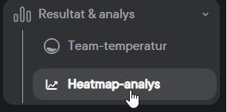
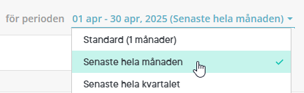

# Frågor och svar - Winningtemp & HRM

**Datum:** den 22 april 2026  
**Kategori:** Employee  
**Underkategori:** Integration  
**Typ:** other  
**Svårighetsgrad:** advanced  
**Tags:** Ingen  
**Bilder:** 2  
**URL:** https://knowledge.flexhrm.com/sv/fragor-och-svar-winningtemp-paneler-0

---

Den här artikeln svarar på vanligt förekommande frågor om integrationen om Winningtemp & HRM
Kan vi visa SMART-index i HRM?
Nej, SMART-index ser du endast i Winningtemp
Visas jämförande index för organisation eller bransch i HRM?
Nej, index som är jämförande med bransch/organisation finns inte med i API-integrationen. Du kan se och ställa in ett jämförande index i Winningtemp, men det kan inte visas i HRM Dashboard.
Kan man kombinera alla “Fråga” med alla “Typ av fråga”?
Index
- kan kombineras med Temperatur och eNPS.
Kategori
- kan kombineras med Temperatur och Custom.
Fråga
- kan kombineras med Temperatur och Custom.
Kan vi styra behörighet för Dashboarden i HRM?
Behörighet per dashboard gäller inte för paneler med data från Winningtemp.
Siffrorna i HRM och i Winningtemp är inte samma, vad beror det på?
För att se att siffrorna stämmer så behöver ni jämföra HRM dashboard med de resultat som ni ser i Winningtemps
Heatmap-analys
med valet för perioden “Senaste hela månaden”.
Detta beror på att panelen i HRM alltid visar hel månad. I Winningtemp finns det möjlighet att se resultaten från mätningarna både på aktuellt datum och för hel månad.
Bilderna nedan visar hur du hittar
Resultat & analys - Heatmap-analys - Senaste hela månaden
i Winningtemp.

Hur visas data i Flex HRM när Winningtemp används för en hel koncern?
Här förklarar vi hur informationen från Winningtemp hanteras i din HRM-lösning när du har alla företag i en koncern samlade i ett och samma Winningtemp-konto.
All data samlas på toppnivån
Eftersom Winningtemp hanterar hela koncernen som en enda enhet, importerar vi all data direkt till toppnivån i det företag i Flex HRM som har kopplingen aktiverad. Systemet utgår från att all information som hämtas hör till det specifika företaget. Detta innebär att du ser data från samtliga företag på den översta nivån i Flex HRM.
Värt att notera är att
Client ID
och
Secret ID
endast kan användas i ett företag i Flex HRM.
Vad händer med en temperaturpanel som inte är kopplad till en organisationsnivå?
Om en temperatur i Winningtemp inte är kopplad till en särskild kontering, kommer Flex HRM att placera den informationen direkt på den högsta nivån (företagsnivån). Det blir alltså en samlingspunkt för all data som saknar specifik organisatorisk koppling.
Relaterade artiklar
⚙️Exempel på Winningtemp-paneler i HRM Dashboard
⚙️Skapa Dashboard i HRM med Winningtemp-paneler
⚙️Pulsmätningar och medarbetarundersökningar - Hur integrerar jag Winningtemp & HRM?
