# ⚙️Bygglösen - Vilka inställningar behöver jag för att kunna ta ut statistiken i HRM Payroll?

**Datum:** den 30 januari 2026  
**Kategori:** Payroll  
**Underkategori:** Löneberedning  
**Typ:** config  
**Svårighetsgrad:** advanced  
**Tags:** lön, löneart  
**Bilder:** 20  
**URL:** https://knowledge.flexhrm.com/sv/byggl%C3%B6sen-vilka-inst%C3%A4llningar-beh%C3%B6ver-jag-f%C3%B6r-att-kunna-ta-ut-statistiken-i-hrm-payroll

---

Artikeln beskriver de inställningar du behöver göra för att kunna ta ut rapport för rapportering av Bygglösen 1.0 (Tidlön). I nuläget har rapporteringen inte stöd för prestationslön.
Behörigheter
Län och kommunkod
Projektregistret
Fördelningstal
Avtalsområde
Lönearter
Anställdaregistret
Lönetransaktioner
Behörigheter
För att få åtkomst till rapporten behöver få detta aktiveras på aktuella roller under
Användare/Behörigheter > Roller
Ställ dig på aktuell roll och i fliken Menyer hittar du Bygglösen under
Administration > Bearbetningar > Statistikrapportering
.
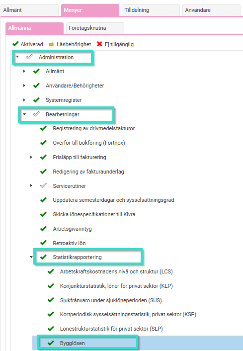
Län och kommunkod
Arbetad tid rapporteras på en län och kommunkod (enligt SCB). Detta ställs in som en konteringsdimension under
Inställningar > Allmänt > Konteringsdimensioner.
Markera att konteringen ska användas för  län och kommunkod.
Under flikarna Tid och Lön markeras
Lägg ut kontering från Projekt
och under fliken Lön markeras även
Använd i löneberedningen
.
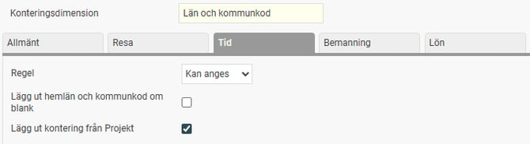
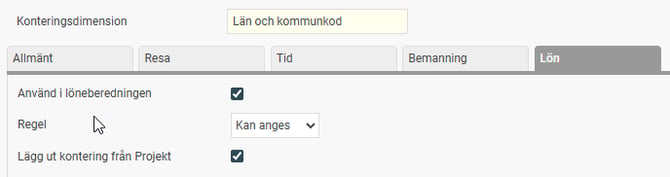
Det tillhörande registret fylls med värden när du sparar konteringsdimensionen första gången med bocken för Använd för län och kommunkod. Tillkommer nya koder måste dessa läggas till i registret.
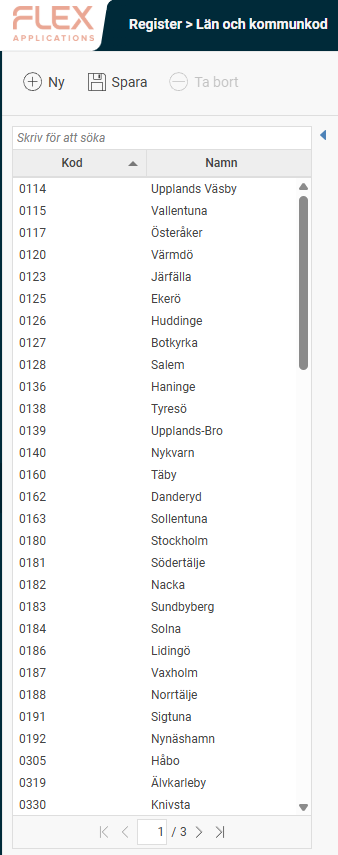
Projektregister
Komplettera projekten i projektregistret med Län och Kommunkod. (Om du tidigare använt Flex Lön och gått över till HRM Payroll och använder 3L Pro behöver du nu för tiden administrera dina projekt manuellt i HRM.)
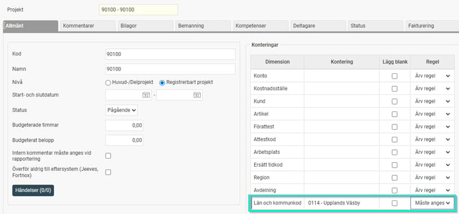
Fördelningstal
Avgör andel av fullbetald timlön för lärlingar.
Detta läggs upp som ett Eget fält under
Inställningar > Personal > Anställdaregistret – egna fält
. Skapa först en tabell för Bygglösen av typen Fältgrupp med datumhistorik.
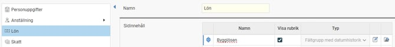
I tabellen skapas ett numeriskt fält för Fördelningstal. Markera
Fältet är ett fördelningstal
.
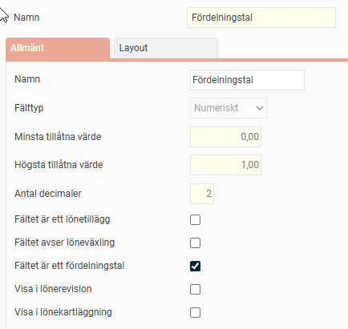
Avtalsområde
Avtalsområde anges på respektive personalkategori under
Inställningar > Lön > Personalkategorier.
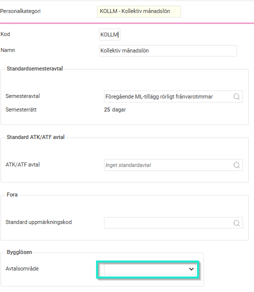
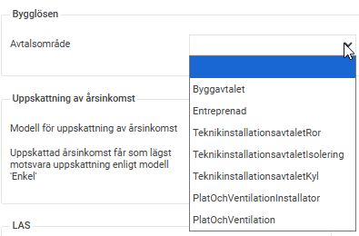
Lönearter
På lönearterna behöver någon av följande bockar markeras beroende på hur lönearten ska rapporteras.
Arbetade timmar
Utbetald lön (tidlön)
Övertidstimmar
Övertidstillägg
OB-tillägg
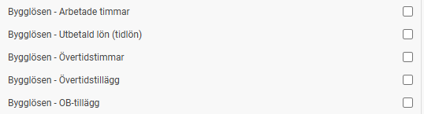
Lönearternas antal/belopp redovisas i rapporten som "varav.....", t.ex. varav övertidstimmar, varav OB-tillägg så flera bockar kan vara aktuella på samma löneart.
Exempel timlön:
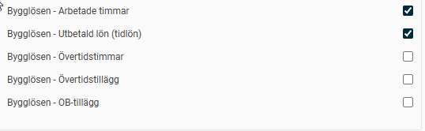
Exempel lönetillägg:
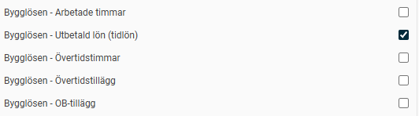
Exempel övertidslöneart:
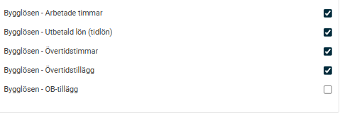
Exempel OB-tillägg:
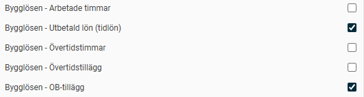
Det finns också en formelfunktion för att hämta fördelningstalet från anställdaregistret i formeln på lönearten.
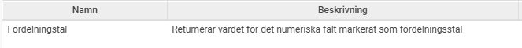
Exempelformel för timlön där hänsyn ska tas till fördelningstal:
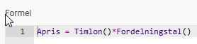
Anställdaregistret
På de anställda registreras följande uppgifter:
Fördelningstal - anges i det egna fältet med datum då respektive fördelningstal ska tillämpas (0,80 = 80%).
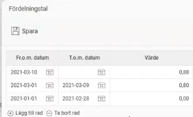
Fälten under fliken Lönestatistik behöver också fyllas i.
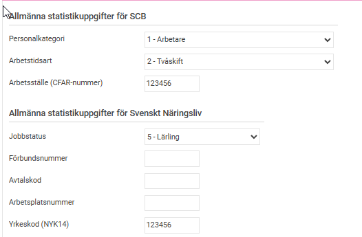
Lönetransaktioner
Transaktionsdatum : För att lönetransaktionerna ska rapporteras korrekt måste det ligga korrekta transaktionsdatum. Om datum saknas använder systemet lönekörningens avvikelseperiod. Om en lärling byter fördelningstal mitt i månaden behöver lönetransaktionerna matcha de olika perioderna för att hämta upp rätt fördelningstal. Om detta inte görs hämtas det senast gällande fördelningstalet. T.ex. behöver då timlön komma in uppdelat (ej läsas in för hela månaden på en rad i lön).
Antal och enhet
Konteringsdimensioner = Projekt, Län & kommunkod
Belopp
Exempel löneberedning där olika timlön ska användas för perioden 1-20/3 och 21-31/3:
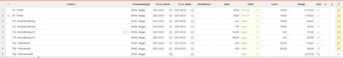
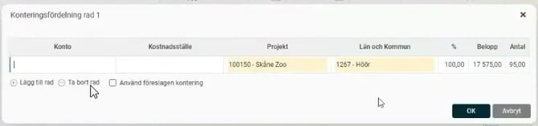
Relaterade artiklar:
Hur tar jag fram rapport till Bygglösen 1.0 (Tidlön) i HRM Payroll?
