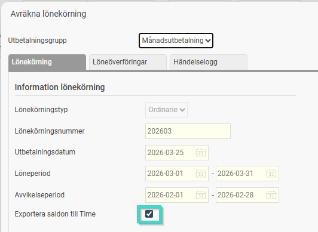
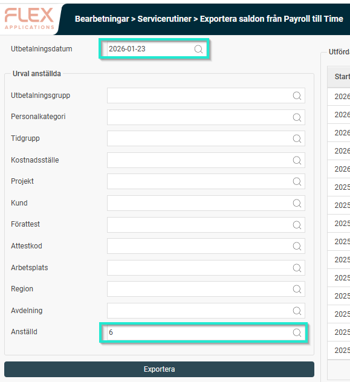

# Export av saldon från lönekörning i HRM Payroll till tidrapport i HRM Time

**Datum:** den 19 mars 2026  
**Kategori:** Payroll  
**Underkategori:** Löneberedning  
**Typ:** other  
**Svårighetsgrad:** intermediate  
**Tags:** hrm-time, lön  
**Bilder:** 2  
**URL:** https://knowledge.flexhrm.com/sv/export-av-saldon-fr%C3%A5n-l%C3%B6nek%C3%B6rning-i-hrm-payroll-till-tidrapport-i-hrm-time

---

Denna artikel beskriver hur saldon kan exporteras från lönekörning till tidrapport.
Hantering av saldoexport
När du är klar med dina inställningar för saldoexport kan du genomföra själva överföringen av data från lön till
HRM Time
. Detta kan göras på två sätt:
Automatisk export:
Exporten sker automatiskt i direkt anslutning till att lönekörningen avräknas.

Manuell export:
Du kan när som helst köra exporten manuellt via menyn
Bearbetningar > Servicerutiner > Exportera saldon från Payroll till Time
. Gör då urval på den lönekörning du vill exportera saldon från samt ev ytterligare urval t.ex. på en enskild anställd.
OBS.
Tänk på att du bara kan exportera saldon till en tidrapporteringsperiod som ej har överförts till lön. Dvs du ska aldrig exportera saldon från tidigare lönekörningar till avräknade tidrapporter.

Exempel på arbetsflöde
När du avräknar lönen för januari 2026 och väljer att exportera saldon, uppdateras de ingående saldona för januari månads tidrapport i
HRM Time
.
Vilka inställningar krävs för att kunna exportera saldon från HRM Payroll till HRM Time?
