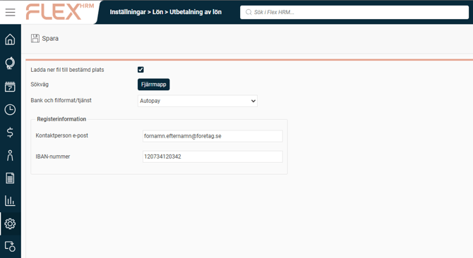
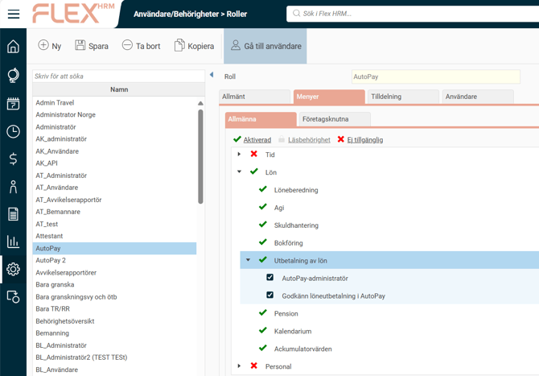
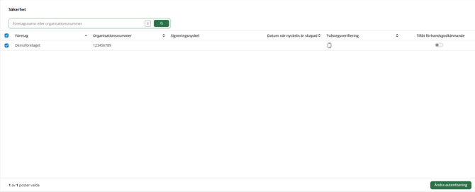
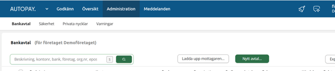
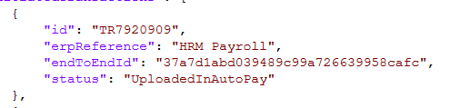
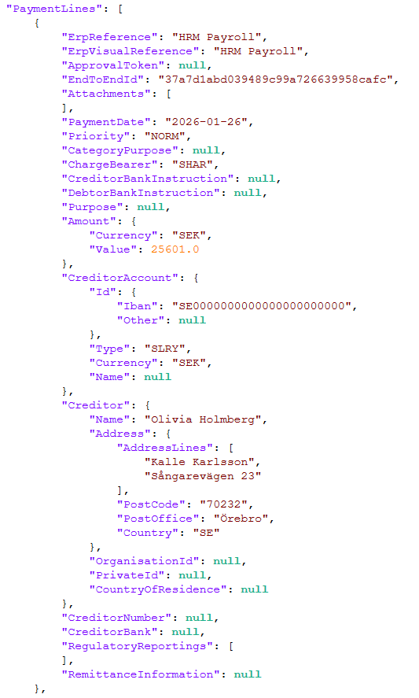

# ⚙️Hur aktiverar och ställer jag in integrationen till Autopay?

**Datum:** den 23 april 2026  
**Kategori:** Payroll  
**Underkategori:** Inställningar  
**Typ:** config  
**Svårighetsgrad:** advanced  
**Tags:** lön  
**Bilder:** 6  
**URL:** https://knowledge.flexhrm.com/sv/hur-aktiverar-och-st%C3%A4ller-jag-in-integrationen-till-autopay

---

Här går vi igenom hur du kommer igång med och använder tjänsten AutoPay för dina löneutbetalningar i HRM Payroll. Med AutoPay skickas dina betalningar direkt från systemet till banken.
Begränsningar att känna till
Just nu stöder vi endast löneutbetalningar inom Sverige. Följande banker är kopplade till tjänsten via AutoPay:
Danske Bank
DNB
Handelsbanken
Nordea
SEB
Viktigt:
För att en anställd ska få sin lön utbetald måste du ange
IBAN
i anställdaregistret i stället för ett svenskt bankkontonummer.
Så här kommer du igång
1. Aktivera tjänsten
Börja med att ställa in rätt format i systemet:
Gå till
Inställningar
>
Lön
>
Utbetalning av lön
.
Välj
Autopay
i fältet
Bank och filformat/tjänst
.
Fyll i e-postadress till kontaktperson och företagets IBAN-nummer som utbetalning ska göras från.

2. Ställ in behörigheter
Du hanterar rättigheter för AutoPay under
Användare/Behörigheter
>
Roller
. För att en användare ska kunna använda dessa funktioner måste hen även ha behörighet att se
Utbetalning av lön
vilket kräver att man är upplagd som
Användare i lön
.
Följande roller finns att tilldela:
AutoPay-administratör:
Ger rätt att skapa bankavtal och ändra inställningar för tvåfaktorsautentisering (2FA) i AutoPays eget gränssnitt.
Godkänn löneutbetalning i AutoPay:
Ger rätt att godkänna utbetalningar. Tänk på att en administratör inte kan godkänna betalningar utan att även ha denna specifika roll.

3. Säkerhet och bankavtal
Innan du kan börja betala ut lön behöver du göra följande inställningar i AutoPays gränssnitt:
Aktivera tvåfaktorsautentisering (2FA):
Gå till
Administration
>
Säkerhet
. Välj ditt företag i listan, klicka på
Ändra autentisering
och följ instruktionerna. Detta krävs för att kunna godkänna utbetalningar.

Lägg till bankavtal:
Gå till
Administration
och klicka på
Nytt avtal…
. Följ instruktionerna för att skapa ett avtal för det bankkonto som du har angett i HRM Payroll.

Genomför en löneutbetalning
När inställningarna är klara kan du exportera dina löner:
Gå till
Lön
>
Utbetalning av lön
.
Markera det du vill exportera.
Klicka på
Starta export
.
Om överföringen lyckas får du en notis med texten ”Export till AutoPay lyckades”. Betalningen finns nu tillgänglig för godkännande i AutoPays gränssnitt för de personer som har rätt roll.
Felsökning
Om en överföring misslyckas kan du hitta information om vad som gått fel i den loggfil som skapas.
Ladda ner loggfilen
Du laddar ner filen genom att klicka på
fil-ikonen
vid det aktuella utbetalningsunderlaget. När du klickar på filen visas en informationsruta som påminner om att detta är en loggfil och inte en bankfil som ska laddas upp manuellt.
Loggfilen innehåller:
All data som vi har skickat till AutoPay.
Svar från AutoPay med status för varje enskild transaktion.
Hitta specifika fel
Om du får information från AutoPay om att en transaktion med ett visst ID har orsakat problem, kan du söka i loggfilen:
Sök efter det ID du fått (det börjar ofta med ”TR”).

När du hittat rätt ID, kopiera värdet för
endToEndId
för samma transaktion.
Sök efter detta
endToEndId
längre ner i filen. Där ser du exakt vilken data som skickades från HRM Payroll, vilket hjälper dig att se vad som behöver korrigeras.

