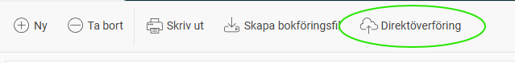
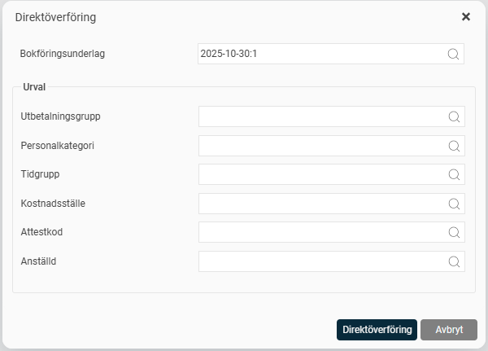
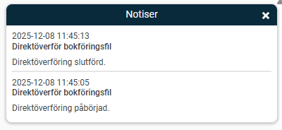
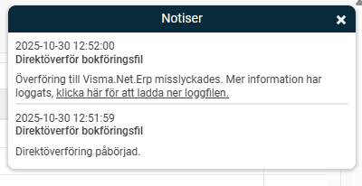

# Hur använder jag funktionen för överföring av bokföringsinformation från HRM Payroll till Visma.Net Finance?

**Datum:** den 19 december 2025  
**Kategori:** Payroll  
**Underkategori:** Bokföring  
**Typ:** howto  
**Svårighetsgrad:** advanced  
**Tags:** bokföring, lön  
**Bilder:** 4  
**URL:** https://knowledge.flexhrm.com/sv/hur-fungerar-%C3%B6verf%C3%B6ring-av-bokf%C3%B6ringsinformation-fr%C3%A5n-hrm-payroll-till-visma.net-finance

---

För att aktivera överföring av bokföringsinformation till Visma.Net Finance kontaktar du oss via
Serviceportalen
Hur integrationen fungerar
Kopplingen från HRM Payroll till Visma.Net kommer att göras från företaget där programlänken skapats till huvudföretaget i Visma.Net.
Överföring av bokföringstransaktioner kommer automatiskt att kopplas till den Huvudbok som har Saldotyp Faktisk i kopplat bolag i Visma.Net.
För att överföring ska ske korrekt krävs även att huvudboken i Visma.Net har SEK som valuta då vi alltid skickar SEK från HRM Payroll.
Använda funktionen
I vyn för Bokföring (
Lön > Bokföring
) finns en knapp för direktöverföring av ett bokföringsunderlag:

Den befintliga knappen för att skapa en bokföringsfil finns fortfarande kvar och kan användas parallellt med den nya direktöverföringen.
När man väljer att göra en direktöverföring får man möjlighet att göra samma urval som när man skapar en bokföringsfil.

När man gjort sina urval klickar man på Direktöverföring i popupen och systemet kommer automatiskt föra över bokföringsunderlaget till Visma.Net.  Vid lyckad överföring får man en notis om att allt gått bra.

Felsökning
Om någonting går fel i överföringen får man en notis med en länk för att ladda ned en loggfil med mer detaljerad information om vad som gått fel.

