# Hur hanterar jag en löneskuld i HRM Payroll?

**Datum:** den 17 december 2025  
**Kategori:** Payroll  
**Underkategori:** Skatt & AGI  
**Typ:** howto  
**Svårighetsgrad:** intermediate  
**Tags:** agi, bokföring, lön, löneart, skatt  
**Bilder:** 15  
**URL:** https://knowledge.flexhrm.com/sv/hur-hanterar-jag-en-l%C3%B6neskuld-i-hrm-payroll

---

Hantera löneskuld som inte kan kvittas (återbetalning)
Om du som arbetsgivare inte har möjlighet att reglera en löneskuld genom avdrag på en senare löneutbetalning, kan du kräva tillbaka det felaktiga beloppet från den anställda.
I dessa fall måste du kräva tillbaka det felaktiga
bruttobeloppet
. Det innebär både det nettobelopp som den anställda fick utbetalt och det skattebelopp som betalades in till Skatteverket. Detta beror på att arbetsgivaren inte har rätt att kräva tillbaka felaktigt inbetald skatt direkt i systemet för arbetsgivardeklaration på individnivå (AGI).
Rätta uppgifter till Skatteverket
När ett återkrav görs ska du också:
Rätta de redovisade uppgifterna till Skatteverket.
Begära omprövning av beslutet om arbetsgivaravgifter.
Om korrigeringen sker ett senare år (efter att den anställda redan blivit beskattad för utbetalningen) måste den anställda själv begära omprövning av sin inkomstdeklaration.
Exempel 1: En anställd har slutat och hela lönen ska betalas tillbaka (bruttoskuld)
En anställd får sin månadslön utbetald i februari. Det visar sig sedan att personen har slutat utan att löneavdelningen fått information om det, och hela lönen (inklusive skatten) ska därför betalas tillbaka.
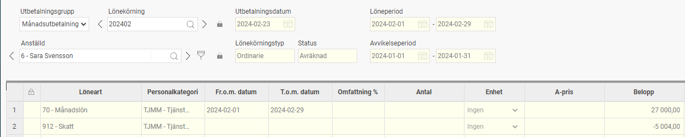
Gör så här:
I det här exemplet har månadslönen betalats ut i den ordinarie lönekörningen och redovisats i arbetsgivardeklarationen (Agi).
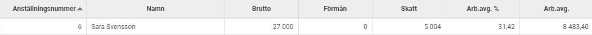
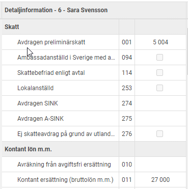
För att rätta detta gör du följande:
Gå till
Lön > Agi
Ta bort kontrollmarkeringen på den aktuella AGI-perioden.
Skapa en extra lönekörning för att rätta rapporteringen. Extrakörningen måste ha ett utbetalningsdatum inom samma månad som den felaktiga utbetalningen gjordes.
Lägg in den löneart som betalats ut felaktigt med ett minustecken i extrakörningen (till exempel löneart
70 Månadslön
).
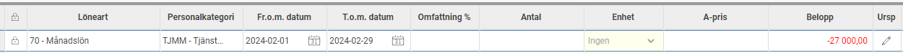
Eftersom skatten inte kan korrigeras ska du inte lägga in någon rad för skatt. Bruttolönen blir då ett negativt värde och skatten blir noll.
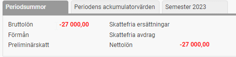
Kontrollera i AGI-underlaget att bruttolönen och arbetsgivaravgiften har nollats, samt att skatten är oförändrad jämfört med den tidigare rapporteringen.
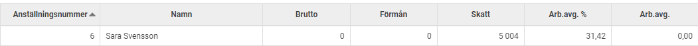
När allt ser rätt ut avräknar du den extra lönekörningen.
Markera AGI-underlaget som kontrollerat och skapa filen med rättelsen som du sedan skickar till Skatteverket.
Exempel 2: Skuld vid tjänstledighet (släpande och innevarande avdrag, bruttoskuld)
När en anställd ska vara tjänstledig en längre tid kan det vara bra att göra avdrag redan för innevarande månad. Om detta inte görs direkt kan en skuld uppstå i lönekörningen när både det släpande och det innevarande avdraget registreras samtidigt.
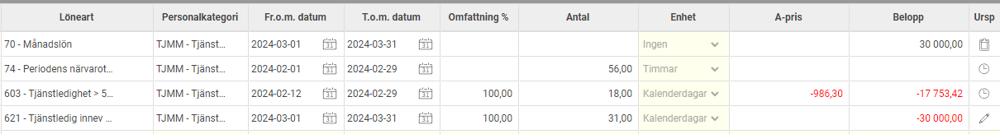
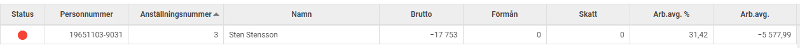
Gör så här:
Eftersom du inte kan rapportera en negativ lön i AGI måste du nolla skulden i löneberedningen:
Kontrollera den utgående skulden (periodens nettolön) under
Periodsummor
.

Lägg in en löneart för
Bruttoskuld till nästa lön
med motsvarande belopp i plus. Detta nollar AGI-underlaget och medarbetaren försvinner ur underlaget.
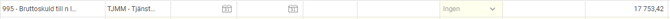
Exempellönearts inställning:
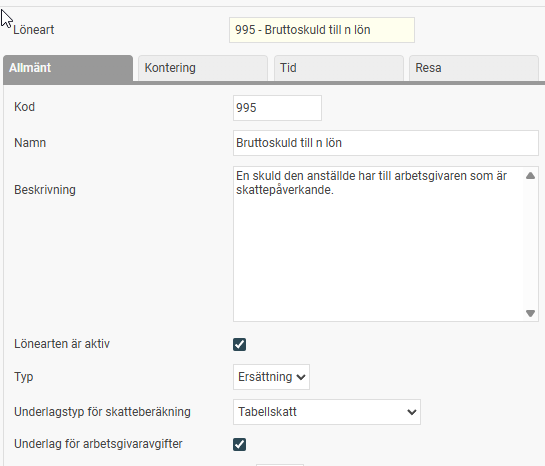
Om du vill att skuldbeloppet ska bokföras behöver lönearten även vara inställd för att skickas till bokföring med rätt kontering.
För att skulden ska komma med i nästa lönekörning behöver du lägga upp en fast transaktion i anställdaregistret via
Personal > Anställda >
[Välj person]
> Fasta transaktioner
. Använd en löneart för
Bruttoskuld från föregående lön
och ange skuldbeloppet med ett minustecken.
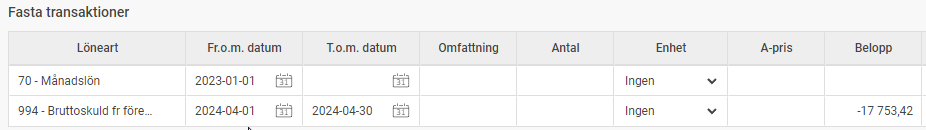
Exempellönearts inställning:
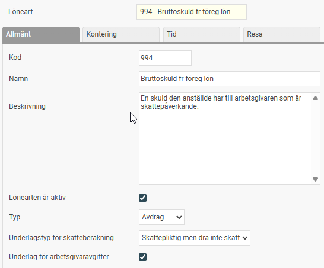
Observera:
Detta behöver du göra för varje månad som skulden finns kvar, med det aktuella skuldbeloppet, tills skulden kan regleras mot en framtida löneutbetalning.
Vid nettoskuld (skulder som uppstår pga ej skattepliktiga ersättningar/avdrag) används istället lönearter för Nettoskuld.
Exempellönearters inställning:
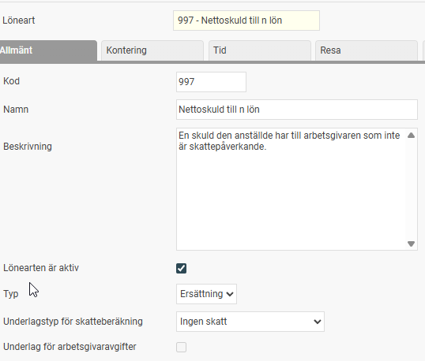
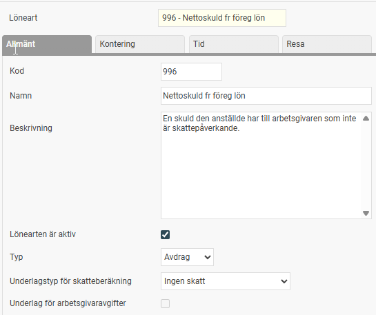
