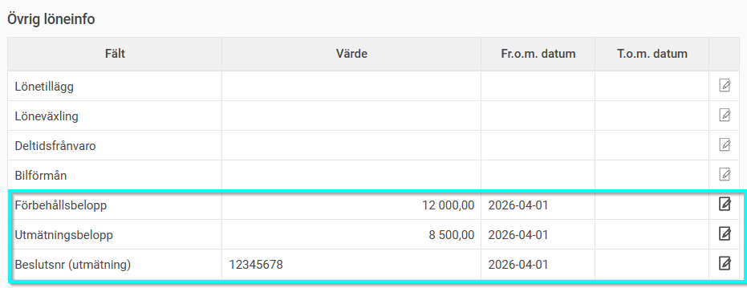
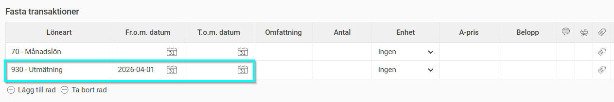
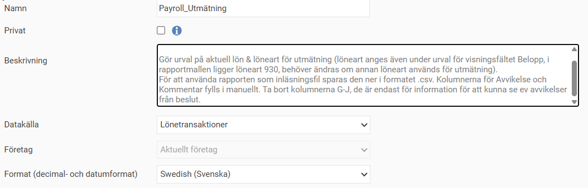
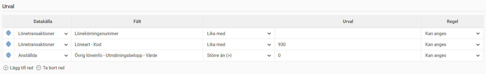
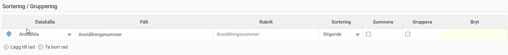
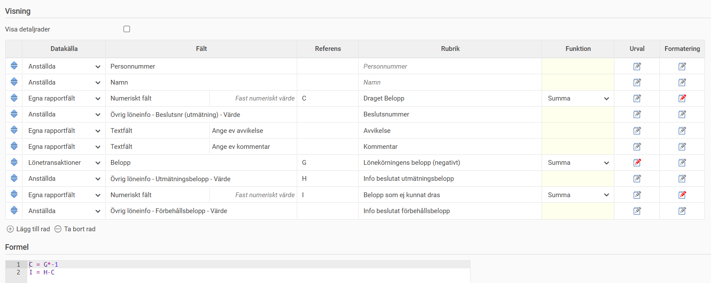
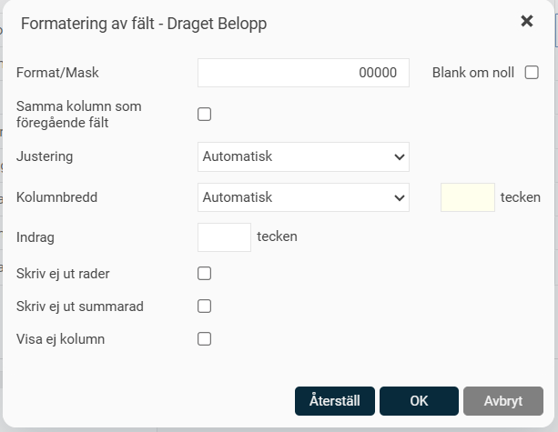
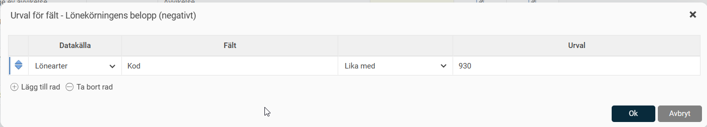
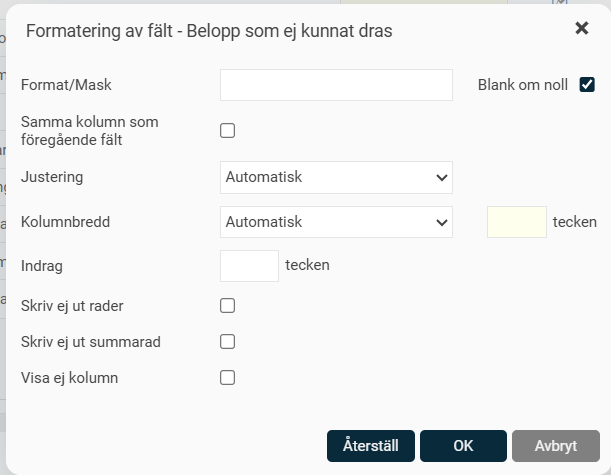
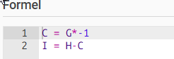

# Hur hanteras utmätning i HRM Payroll?

**Datum:** den 20 april 2026  
**Kategori:** Payroll  
**Underkategori:** Löneberedning  
**Typ:** howto  
**Svårighetsgrad:** advanced  
**Tags:** lön, löneart  
**Bilder:** 10  
**URL:** https://knowledge.flexhrm.com/sv/hur-hanteras-utm%C3%A4tning-i-hrm-payroll

---

I den här artikeln beskriver vi hur du hanterar ett beslut om utmätning för avdrag i löneberedningen i HRM Payroll.
Registrera utmätning på en anställd
När en medarbetare har en beslutad utmätning behöver du registrera uppgifterna i systemet för att avdraget ska bli korrekt i löneberedningen. Du fyller i information om utmätningens belopp, förbehållsbelopp och beslutsnummer i anställningsregistret.
Så här gör du:
Gå till
Personal > Anställda > Lön
.
Välj den aktuella medarbetaren i listan.
Leta upp fälten för utmätning (dessa är ofta placerade under rubriken Övrig löneinfo.
Ange information i följande fält:
Utmätningsbelopp
: Ange det belopp som ska mätas ut.
Förbehållsbelopp
: Ange medarbetarens förbehållsbelopp.
Beslutsnr (utmätning)
: Fyll i numret på beslutet från Kronofogden.

Klicka på
Spara
.
Bra att veta:
Dessa fält är så kallade "Egna fält" och kan i din uppsättning ha andra namn. Om du inte hittar dem under fliken
Lön
kan de vara placerade på en annan flik i din konfiguration av Flex HRM.
För att avdraget för utmätningen ska dras automatiskt vid varje lönekörning behöver du lägga upp lönearten för utmätning som en fast transaktion på medarbetaren.
Så här gör du:
Gå till
Personal > Anställda > Lön
.
Välj den aktuella medarbetaren i listan.
I tabellen för Fasta transaktioner, klicka på
Lägg till rad
.
I fältet
Löneart
, välj lönearten för utmätning (exemplet visar löneart 930).
Kontrollera att datumintervallen stämmer överens med beslutet från Kronofogden.
Klicka på
Spara
.

I rapportgeneratorn kan du bygga en rapport för att hämta ut uppgifter om lönekörningens utmätningar för rapportering till kronofogden. Se exempel på rapportens utformning nedan.

På fältet Draget belopp ligger en formatering för att sätta värdet till fem tecken:

På fältet för Lönekörningens belopp (negativt) ligger ett urval för att hämta draget utmätningsbelopp från löneart 930:

På fältet för Belopp som ej kunnat dras ligger en formateringsinställning för att blanka värdet om resultatet är noll:

Referenskolumnerna C, G, H, I används i formelfältet för att räkna ut draget belopp som ett positivt belopp i rapporten (C, för inrapporteringen till kronofogden) samt räkna ut det belopp som ej kunnat dras pga förbehållsbeloppet (I).

