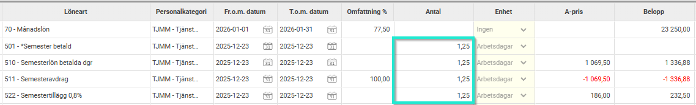
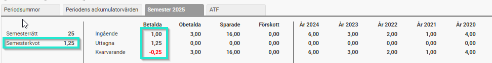
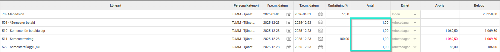
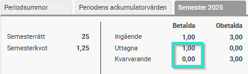
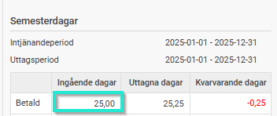
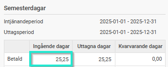
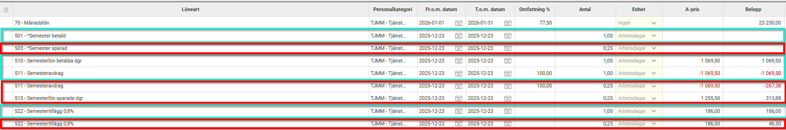
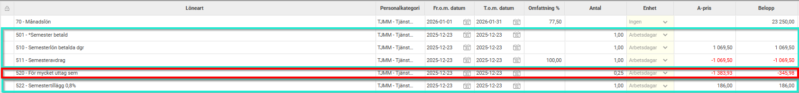

# Hur korrigerar jag semestersaldo som blivit minus i kvarvarande dagar?

**Datum:** den 12 januari 2026  
**Kategori:** Payroll  
**Underkategori:** Semesterhantering  
**Typ:** howto  
**Svårighetsgrad:** advanced  
**Tags:** agi, lön, löneart, semester  
**Bilder:** 8  
**URL:** https://knowledge.flexhrm.com/sv/hur-korrigerar-jag-semestersaldo-som-blivit-minus-i-uttagna-dagar

---

Hantering av semestersaldon som hamnat i minus
Om en medarbetare, t.ex. p.g.a. semesterkvot tagit ut mer semester än vad som finns kvar i saldot kan manuell justering behövas i lönekörningen för att flytta överuttaget med hjälp av lönearter. Detta då en dag inte kan fördelas mellan olika saldon. Hur korrigeringen ska göras beror lite på ert kollektivavtal/regelverk.
Exempel:
Anställd har en semesterkvot på 1,25 då denne jobbar 4 dagar/vecka i snitt.
I saldot för årets betalda dagar finns endast 1 dag kvar.
I december 2025 har medarbetaren varit ledig 1 arbetspass och semesteravdrag beräknas i januaris lönekörning med kvoten 1,25. I exemplets semesteravtal görs semesteravdrag samt utbetalas ersättning med semesterlön (4,6%) och semestertillägg (0,8%) per uttagen dag.

Detta gör att årets betalda dagar får ett utgående värde på -0,25.

Alternativ 1:
Semesteruttaget för den sista dagen ska endast belasta årets betalda dagar. Medarbetaren har rätt att vara ledig hela passet och får semesterlön för det saldo hen har kvar.
Korrigera antal på lönearten för uttag av betald semester till 1,0 (OBS: detta justerar då också kopplade lönearter för t.ex. semesteravdrag/semesterlön/semestertillägg).

Semestersaldot korrigeras och utgående värde blir 0.

Alternativ 2:
Semesteruttaget för den sista dagen ska endast belasta årets betalda dagar. Medarbetaren har rätt att vara ledig hela passet och får semesterlön för hela passet.
Justera ingående saldo för betalda semesterdagar i anställningsregistret under fliken semester till 1,25.
Före ändring:

Efter ändring:

Alternativ 3:
Överskjutande semesteruttag ska belasta saldot för sparad semester.
Korrigera antal på lönearten för uttag av betald semester till 1,0.
Lägg ut lönearten för uttag av sparad semester med samma transaktionsdatum och antal 0,25.

Alternativ 4:
Överskjutande semesteruttag ska belasta saldot för sparad semester. Saldot för sparad semester är 0 och istället görs tjänstledighetsavdrag för överuttaget.
Korrigera antal på lönearten för uttag av betald semester till 1,0.
Lägg ut lönearten för överuttag av semester med samma transaktionsdatum och 0,25 dagar.

