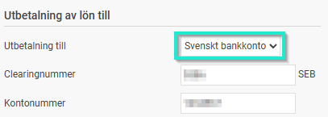
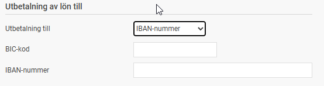
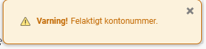

# Hur registreras bankkonton för utbetalning av lön i HRM Payroll?

**Datum:** den 22 december 2025  
**Kategori:** Payroll  
**Underkategori:** Övrigt  
**Typ:** howto  
**Svårighetsgrad:** intermediate  
**Tags:** lön  
**Bilder:** 4  
**URL:** https://knowledge.flexhrm.com/sv/hur-registreras-bankkonton-f%C3%B6r-utbetalning-av-l%C3%B6n-i-hrm-payroll

---

Här beskriver vi hur du registrerar en medarbetares bankkonto för utbetalning av lön i HRM Payroll.
Så här gör du:
Gå till
Personal > Anställda
.
Välj den medarbetare det gäller och klicka på fliken
Lön
.
Välj
Utbetalning till > Svenskt bankkonto
alternativt
IBAN-nummer

Fyll i uppgifterna för
Clearingnummer
och
Kontonummer
alternativt
BIC-kod
och
IBAN-nummer
.
Viktigt att tänka på:
Clearingnummer:
Ange det kompletta clearingnumret. Om medarbetaren har Swedbank ska du till exempel ange samtliga fem siffror.
Kontonummer:
Eftersom olika banker har olika regler för hur många siffror ett kontonummer ska innehålla, kan du ibland behöva lägga till utfyllnadsnollor.
Validering:
I
Flex HRM
finns en inbyggd validering som varnar dig om de uppgifter du har fyllt i behöver kontrolleras. Dessa kan se lite olika ut, t.ex.:

