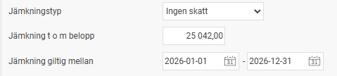

# Hur registreras skattebefrielse för ungdomar?

**Datum:** den 3 mars 2026  
**Kategori:** Payroll  
**Underkategori:** Skatt & AGI  
**Typ:** howto  
**Svårighetsgrad:** intermediate  
**Tags:** lön, skatt  
**Bilder:** 1  
**URL:** https://knowledge.flexhrm.com/sv/hur-registreras-skattebefrielse-f%C3%B6r-ungdomar

---

Skolungdomar och studerande kan tjäna upp till ett visst belopp varje år utan att behöva betala skatt. Beloppet fastställs av Skatteverket och varierar från år till år. Om en medarbetare uppfyller kraven för skattebefrielse behöver du registrera detta i anställdaregistret för att lönen ska beräknas korrekt i HRM Payroll.
Så registrerar du skattebefrielse
Följ dessa steg för att ställa in skattebefrielse med hjälp av funktionen jämkning för en anställd:
Gå till
Anställda > Anställdaregistret
.
Välj den aktuella personen i listan.
Gå till fliken
Skatt
.
I fältet
Jämkningstyp
, välj alternativet
Ingen skatt
.
Ange det högsta belopp som medarbetaren får tjäna utan skatt i fältet
Jämkning t o m belopp
.
Ange under vilken period som jämkningen ska gälla i fälten
Jämkning giltig mellan
.

När dessa inställningar är sparade kommer systemet automatiskt att sluta dra skatt på personens lön fram till dess att det angivna maxbeloppet är uppnått eller att giltighetstiden har gått ut.
OBS. För dessa medarbetare bör ej FOS-förfrågan användas då det kommer skriva över den inlagda jämkningen.
