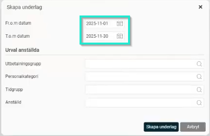

# Hur tar jag fram rapport till Bygglösen  i HRM Payroll?

**Datum:** den 19 januari 2026  
**Kategori:** Payroll  
**Underkategori:** Löneberedning  
**Typ:** howto  
**Svårighetsgrad:** intermediate  
**Tags:** lön, löneart  
**Bilder:** 7  
**URL:** https://knowledge.flexhrm.com/sv/hur-rapporterar-jag-byggl%C3%B6sen-1.0-tidl%C3%B6n-i-hrm-payroll

---

Denna artikel beskriver hur du tar ut rapport för Bygglösen 1.0 (Tidlön) i systemet.
Skapa underlag
Skapa fil för rapportering
Vilka medarbetare innehåller underlaget
Så här skapar du ett nytt underlag
Det första steget i rapporteringen är att skapa ett underlag för den månad som rapporteringen gäller.
Gå till
Administration
>
Bearbetningar
>
Statistikrapportering
>
Bygglösen
.
Klicka på knappen
Ny
i knappraden.

Välj aktuell
löneperiod
.
Observera:
Om du använder bruten löneperiod skapas underlaget för den motsvarande perioden.
Om det behövs kan du även göra kompletterande urval för att begränsa underlaget.

I det färdiga underlaget kan en medarbetare redovisas på flera rader. Det händer till exempel om hen har utfört arbete i olika län eller med olika kommunkoder.

Du kan också exportera underlaget till Excel genom att klicka på knappen
Excel
i knappraden.

När underlaget är granskat markerar du underlaget som kontrollerat genom att klicka på knappen
Markera som kontrollerad
.

Underlaget får då statusen
Kontrollerad
. Systemet sparar även datum, tid och användarsignatur för den som genomfört kontrollmarkeringen.

Om du hittar ett fel i ett kontrollerat underlag kan du ta bort kontrollmarkeringen igen, vilket gör att statusen återigen blir preliminär.
Fil för redovisning
När underlaget har sammanställts genereras automatiskt en rapportfil. Denna fil underlättar rapporteringen till och kan hämtas via knappen
Visa filer
i knappraden.

Listan över filer innehåller en fil per redovisningsperiod, där den senaste ligger överst. Filen finns tillgänglig tills du väljer att ta bort underlaget i huvudvyn. Ladda ner filen genom att klicka på ikonen och skicka in den.
Vilka medarbetare inkluderas i rapporten?
För att en medarbetare ska komma med i underlaget behöver följande två kriterier vara uppfyllda:
Medarbetaren tillhör en personalkategori som är kopplad till ett avtalsområde.
Medarbetaren har registrerade arbetade timmar i lönekörningen. Detta innebär att det finns en löneart som har markeringen för arbetad tid.
Relaterade artiklar:
Vilka inställningar behövs för att kunna rapportera Bygglösen 1.0 (Tidlön) i HRM Payroll
