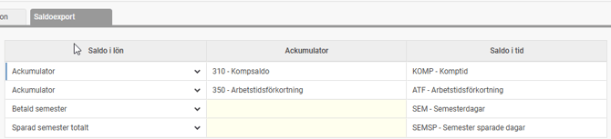
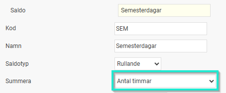
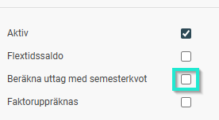

# ⚙️Inställning av export av saldon från HRM Payroll till HRM Time

**Datum:** den 19 mars 2026  
**Kategori:** Payroll  
**Underkategori:** Inställningar  
**Typ:** config  
**Svårighetsgrad:** intermediate  
**Tags:** hrm-time, lön, semester  
**Bilder:** 3  
**URL:** https://knowledge.flexhrm.com/sv/inst%C3%A4llning-av-export-av-saldon-fr%C3%A5n-hrm-payroll-till-hrm-time

---

Denna artikel beskriver hur du ställer in systemet för att exportera saldon, t.ex. semester, komp, arbetstidsförkortning, från Payroll till Time.
Du hittar inställningarna via menyn
Administration > Inställningar > Lön > Lönekörningar
.
Under fliken
Saldoexport
ställer du in vilka saldon som ska föras över från lönemodulen
HRM Payroll
till
HRM Time
. Detta gör att anställda kan se sina aktuella saldon i tidrapporten.
Koppla saldon mellan systemen
Här mappar du saldon från lönekörningen i
HRM Payroll
till rätt mottagande saldo i
HRM Time
:
Saldo i lön:
Du kan exportera antingen en
ackumulator
(till exempel komptid, tidbank eller arbetstidsförkortning) eller ett
saldo
(till exempel semester eller arbetstidsförkortning via funktionen för ATK/ATF avtal).
Saldo i tid:
Välj vilket saldo i
HRM Time
som ska ta emot värdet.

Då semesterdagar i
HRM Payroll
beräknas som bruttodagar finns det kompletterande inställningar man kan göra för att påverka hur saldot visas för den anställde i
HRM Time
.
För att exportera semesterdagar omvandlat till timmar behöver mottagande saldo i HRM Time vara inställt att summera Antal timmar.

För att exportera semesterdagar och i HRM Time visa upp nettovärdet (bruttodagar / aktuell semesterkvot) behöver saldot vara inställt att ej beräkna uttag med semesterkvot (dvs denna ruta ska ej vara ibockad).

Hantering av export av saldon
