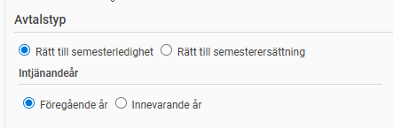
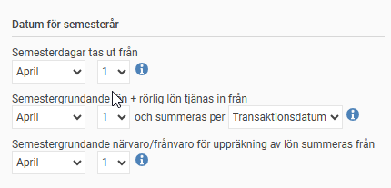
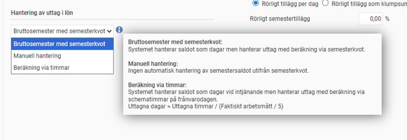
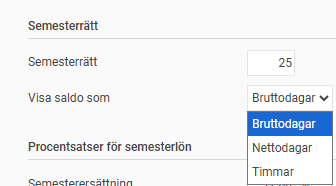
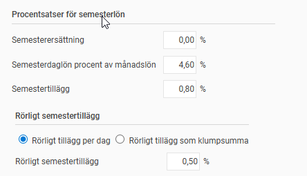
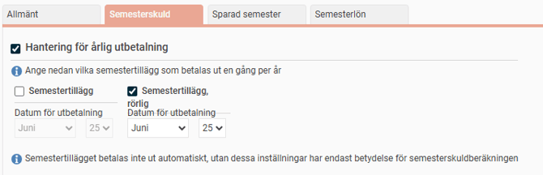
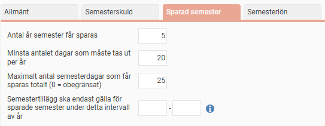
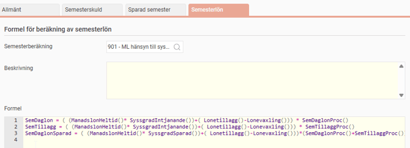
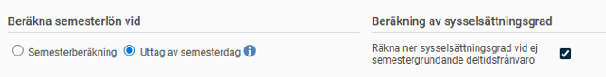

# ⚙️Inställning av semesteravtal

**Datum:** den 24 mars 2026  
**Kategori:** Payroll  
**Underkategori:** Semesterhantering  
**Typ:** config  
**Svårighetsgrad:** advanced  
**Tags:** lön, semester  
**Bilder:** 9  
**URL:** https://knowledge.flexhrm.com/sv/inst%C3%A4llning-av-semesteravtal

---

I den här artikeln går vi igenom hur du ställer in semesteravtal i systemet.
Du hittar inställningarna via menyn
Inställningar > Lön > Semesteravtal
.
I listan till vänster ser du de semesteravtal som finns upplagda. När du markerar ett avtal visas informationen för det avtalet till höger.
Fliken Allmänt
Under fliken
Allmänt
fyller du i grundläggande uppgifter för semesteravtalet:
Namn:
Skriv namnet på semesteravtalet.
Beskrivning:
Här kan du lägga till en beskrivning av avtalet.
Avtalstyp:
Välj mellan rätt till semesterledighet eller rätt till semesterersättning. För anställda som får semesterersättning direkt på intjänad lön kan vi ackumulera beloppet och göra en utbetalning vid ett senare tillfälle.

Datum för semesterår
Intjänandeår:
Ange om systemet ska räkna innevarande år eller föregående år som intjänandeår.
Datum för semesterår:
Detta fält ändras automatiskt beroende på vilket intjänandeår du har valt.
Semesterdagar tas ut från:
Ange semesterårets startdatum, t.ex. 1 januari eller 1 april.
Semestergrundande lön + rörlig lön tjänas in från:
Ange från vilket datum semestergrundande lön / rörlig lön ska summeras på semesteråret. T.ex. 1 januari eller 1 april.
Om du har ett avtal där semesterlönen beräknas som en procentsats på den semestergrundande lönen, behöver systemet justera upp lönen för den tid den anställde haft semestergrundande frånvaro. För att beräkningen ska bli rätt behöver vi få fram en korrekt snittlön för arbetad tid.
Du kan välja om summeringen ska ske per
Utbetalningsdatum
eller
Transaktionsdatum
:
Utbetalningsdatum (kontantprincipen):
Kan ibland ta med lön för arbete som utförts under andra perioder, vilket kan ge ett missvisande snitt.
Transaktionsdatum:
Ger ofta en mer exakt snittberäkning då lön och närvaro stämmer överens tidsmässigt.
Viktigt:
Tänk igenom beslutet noga innan du byter princip. Om du byter från kontantprincipen till transaktionsdatum vid ett semesterskifte finns det en risk att vissa transaktioner (exempelvis i mars med utbetalning i april) inte hamnar på något semesterår alls. Det kan leda till att den anställde får för låg semestergrundande lön.
Klicka på
i-symbolen
i systemet för att få mer information om hur du bör tänka kring dessa datumval.
Semestergrundande närvaro/frånvaro för uppräkning av lön summeras från:
Ange från vilket datum semestergrundande närvaro/frånvaro ska summeras på semesteråret. T.ex. 1 januari eller 1 april.

Hantering av uttag i lön:
Ange hur systemet ska beräkna uttagen semester i löneberedningen. Detta är särskilt viktigt för anställda som arbetar oregelbundet och har en semesterkvot. Välj
Beräkning via timmar
om du vill att systemet ska hantera saldot i timmar istället för dagar. Klicka på
i-symbolen
i systemet för att få mer information om hur du bör tänka kring dessa val.

Utfall i lönekörning vid Beräkning via timmar:
Anställd med veckoarbetstid 40 timmar per vecka men oregelbunden arbetstid per dag:
Schematid måndag 1/9 är 11 timmar
Schematid tisdag 2/9 är 5 timmar
Beräkningsformel: Uttagna dagar = Uttagna timmar / (Faktiskt arbetsmått / 5)
Semester måndagen 1/9 blir då enligt formeln:
11 / (40 / 5) = 1.375 vilket avrundas till 1.38 dagar
Semester tisdagen 2/9 blir då enligt formeln:
5 / (40 / 5) = 0.625 vilket avrundas till 0.63 dagar
Semesterrätt:
Ange hur många semesterdagar som ingår i avtalet.
Visa saldo som:
Ange hur saldot ska visas på lönespecifikationen. I  löneberedningen och i anställdaregistret kan visningen styras via ett drop-down val. Det går inte att skapa ett personligt semesteravtal med avvikande inställning för Visa saldo som.

Visa saldo som Timmar
För att systemet ska visa semestersaldo som timmar istället för dagar används valet “Timmar” under rubriken “Semesterrätt”. Detta ställs in direkt på semesteravtalet och är inte möjligt att göra  personliga avvikelser på i anställdaregistret för enskilda medarbetare .
För att visa upp semestersaldo som timmar använder vi formeln:
Bruttodagar * (Faktiskt arbetsmått per vecka / 5)
Avrundning för visa som timmar:
När man visar semestersaldot som timmar kommer systemet automatiskt att avrunda timmarna uppåt till närmaste hela timme. Denna avrundning är till för att inte behöva visa decimaler för de anställda och påverkar bara visningen.
Visa saldo som Nettodagar
För a
tt systemet ska visa semestersaldo som nettodagar istället för bruttodagar används valet “Nettodagar” under rubriken “Semesterrätt”. Detta ställs in direkt på semesteravtalet och är inte möjligt att göra  personliga avvikelser på i anställdaregistret för enskilda medarbetare .
Med valet att visa saldo som Nettodagar kommer semstersaldo att visas som nettodagar på lönespecifikationen för anställda som har det aktuella semesteravtalet.
Avrundning för visa som nettodagar:
När man visar semestersaldot som nettodagar kommer systemet automatiskt att avrunda timmarna uppåt till närmaste hela dag. Denna avrundning är till för att visa för den anställde hur många faktiska dagar denne kan vara ledig.
Procentsatser för semesterlön:
Fyll i procentsatser för semesterersättning, semesterdaglön (i procent av månadslönen) och semestertillägg.
Rörligt semestertillägg:
Välj om programmet ska beräkna det rörliga tillägget per dag eller per år. Här anger du även procentsatsen för det rörliga tillägget.

Fliken Semesterskuld
Under fliken
Semesterskuld
hanterar du inställningarna för den årliga utbetalningen av både det ordinarie semestertillägget och det rörliga semestertillägget.
Här anger du vilket datum utbetalningen ska ske. Detta datum är viktigt för systemets beräkningar:
Påverkan på semesterskulden:
Efter det datum du anger här kommer tilläggen inte längre att räknas med i semesterskuldsberäkningen.

Fliken Sparad semester
Under fliken
Sparad semester
ställer du in reglerna för hur anställda får spara sina semesterdagar över flera år.
Antal år semesterdagar får sparas:
Ange hur många år en anställd får behålla sina sparade dagar.
Minsta antalet dagar som måste tas ut per år:
Här anger du hur många semesterdagar som den anställde måste ta ut varje år och som alltså inte får sparas.
Maximalt antal semesterdagar som får sparas totalt:
Om ni har ett avtal med en gräns för hur många dagar en anställd får ha totalt i sin pott för sparad semester, anger du det antalet här. Om du lämnar fältet som 0 (noll) är det möjligt att spara ett obegränsat antal dagar.
Semestertillägg ska endast gälla för sparade semester under detta intervall av år:
Om semestertillägg på sparade dagar endast ska inkluderas för ett visst intervall av år, t.ex. för att man efter ett visst år utbetalar semestertillägget i klump, anges intervallet här. För att semestertillägg ska inkluderas för sparade dagar på angivna år i intervallet måste detta också beräknas i formeln med hjälp av formelfunktionen SemTillaggProc().

Fliken Semesterlön
Under fliken
Semesterlön
kopplar du rätt beräkningsmodeller till ditt semesteravtal.
Formel för beräkning av semesterlön:
Här anger du vilken formel som ska användas för att räkna ut semesterlönen i det aktuella avtalet. Du kan se och skapa dessa formler under
Inställningar > Lön > Semesterlöneformler
.
Semesterberäkning (förstoringsglaset):
Om du klickar på förstoringsglaset får du upp en lista med fördefinierade formler som finns i registret för Semesterlöneformler.
Beskrivning och Formel:
I listan ser du ev angiven
Beskrivning
av formeln och under kolumnen
Formel
ser du den tekniska uppbyggnaden av själva beräkningen.

Beräkna semesterlön vid:
Här väljer du när systemet ska fastställa värdet på semesterlönen. Du har två alternativ:
Semesterberäkning:
Systemet använder det sparade värdet som beräknades vid det senaste semesterskiftet. Detta värde visas sedan i anställningsregistret.
Uttag av semester:
Systemet gör en ny beräkning vid varje tillfälle som semester tas ut. I anställningsregistret visas då ett aktuellt beräknat värde.
Räkna ner sysselsättningsgrad vid ej semestergrundande deltidsfrånvaro:
Om ej semestergrundande deltidsfrånvaro ska minska värdet på semesterdagarna används denna inställning för att räkna ut en genomsnittlig sysselsättningsgrad på närvaron för semesteråret. I formeln används då formelfunktionen SyssgradIntjanande() för att hämta upp den genomsnittliga sysselsättningsgraden.

