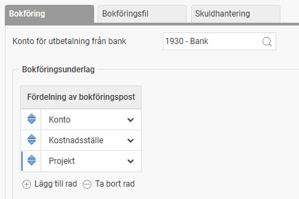
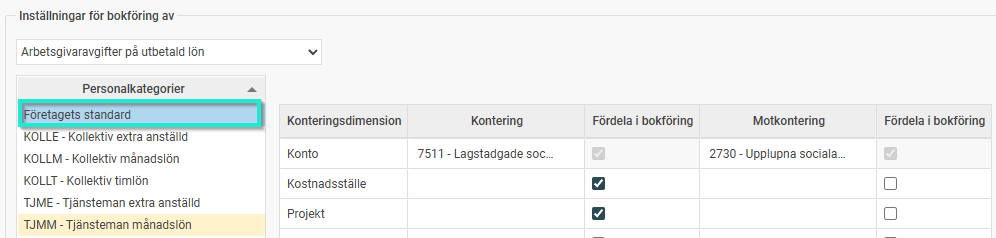
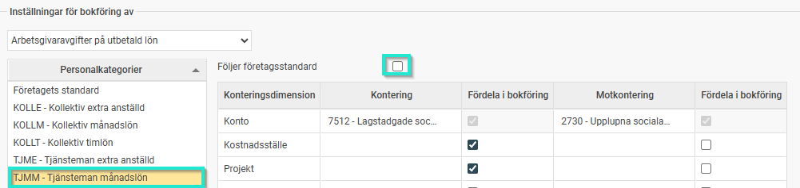
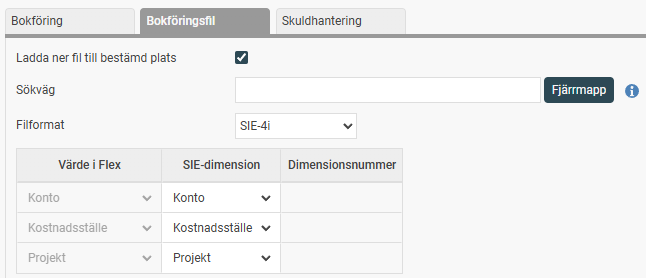

# ⚙️Inställningar av Bokföring och skuldhantering i HRM Payroll

**Datum:** den 25 februari 2026  
**Kategori:** Payroll  
**Underkategori:** Semesterhantering  
**Typ:** config  
**Svårighetsgrad:** advanced  
**Tags:** bokföring, lön, löneart, semester  
**Bilder:** 5  
**URL:** https://knowledge.flexhrm.com/sv/inst%C3%A4llningar-av-bokf%C3%B6ring-och-skuldhantering-i-hrm-payroll

---

I den här vyn gör du inställningar för hur lönekostnader, arbetsgivaravgifter och skulder ska hanteras i bokföringen. Du når funktionen via: Administration > Inställningar > Lön > Bokföring och skuldhantering Klicka på Inställningar och välj Bokföring av lönekostnader i menyn för att öppna inställningarna.
Fliken Bokföring
Här ställer du in grunderna för ditt bokföringsunderlag och hur poster ska fördelas.
Konto för utbetalning från bank:
Ange vilket konto som ska användas för utbetalningar. Du kan söka i kontoregistret genom att klicka på
förstoringsglaset
.
Bokföringsunderlag:
Dessa inställningar styr bokföringsunderlagets.
Fördelning av bokföringspost:
Välj hur posterna ska fördelas som standard. Konto måste alltid vara en av nivåerna. Tillgängliga val är samtliga konteringsdimensioner som har inställningen
Används för bokförin
g under
Inställningar – Konteringsdimensioner, flik Allmänt
.
Dessutom finns det möjlighet att gruppera bokföringsposterna per anställningsnummer respektive löneart.
Klicka på
Lägg till rad
för att lägga till fler dimensioner (till exempel kostnadsställe).

Inställningar för bokföring av:
Välj vilket område inställningarna ska gälla för.
Personalkategorier:
Markera en personalkategori för att göra specifika inställningar för vald kategori. Om en kategori avviker från företagets standard markeras den i gult.
Följer företagsstandard:
Markera denna ruta om kategorin ska följa de gemensamma inställningarna. Då låses övriga fält för redigering. Ta bort markeringen om personalkategorin ska ha en avvikande inställning.
Konteringsinställningar:
Ange kontering och motkontering för varje dimension. Du kan även för samtliga konteringsdimensioner ställa in om fördelning av kontering och/eller fördelning av motkontering ska göras på bokföringsunderlaget. I bilderna har vi ställt in att konto 7511 (företagsstandard) och 7512 (avvikande konto för personalkategorin TJMM) även ska fördelas på kostnadsställe och projekt som hämtas från medarbetarens hemkontering då vi lämnat konteringsfältet tomt för dessa nivåer.

Fliken Bokföringsfil
Här hanterar du hur den bokföringsfilen ska skapas och sparas.
Ladda ner fil till bestämd plats:
Välj om filen ska sparas lokalt eller i en
Fjärrmapp
.
Sökväg:
Ange den exakta platsen för fjärrmappen där du vill att filen ska sparas.
Filformat :
SIE-4i, här kopplar du systemets värden till rätt SIE-dimensioner.

Du kan även koppla en uppsatt exportmall.

Behöver du hjälp med att sätta upp en specifik exportmall för din bokföringsfil? Se
artikeln om exportmallar
.
Fliken Skuldhantering
Här väljer du vilken modell vi ska använda för att beräkna företagets skulder.
Räkna bort semester som betalats ut månaden efter skulddatumet:
Det vanligaste är att man per skulden för t.ex. 31 oktober tar med alla semesterpengar som ännu inte är utbetalda detta datum. Om jag t.ex. är ledig 5 semesterdagar i oktober, som jag får semesterlön utbetald för i november anser de flesta att dessa pengar ska finnas med i skulden för den 31 oktober, då de ännu inte är utbetalda detta datum. Det finns dock en alternativ tolkning som också tillämpas och som innebär att man räknar bort de pengar som hör till ledighet i oktober trots att de betalas ut nästkommande månad. Om man i företaget tillämpar denna beräkningsmodell kryssar man i valet Räkna bort semester som betalas ut månaden efter skulddatumet och skuldlistan per 31 oktober skapas då först i lönekörningen för november.
Ta med förskottssemester i semesterskuld med beräkningstyp ”Bokföring av skuld”:
Om du vill att förskottssemester ska tas med i den bokförda skulden markerar du denna ruta. Om rutan är urbockad räknas förskottssemester inte med, vilket är vanligt för att undvika att boka upp skulder som inte är återbetalningspliktiga vid exempelvis konkurs.
Tillåt att man skapar flera skulder av typen ”Bokföring av skuld” med samma skulddatum:
Aktivera detta om du behöver skapa flera separata skuldberäkningar för samma datum.
Observera:
Var noggrann med urvalet av anställda så att ingen person kommer med i flera beräkningar, eller inte kommer med i någon beräkning vilket kan leda till att skulden bokförs dubbelt/inte alls.
