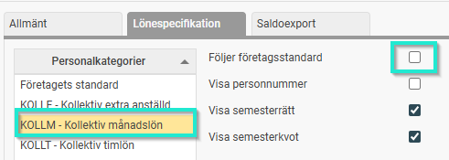
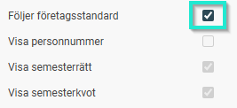
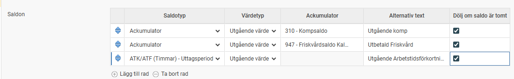
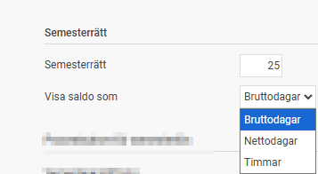
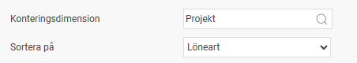
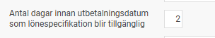
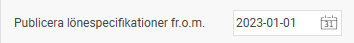

# ⚙️Inställningar av lönespecifikationen

**Datum:** den 25 mars 2026  
**Kategori:** Payroll  
**Underkategori:** Löneberedning  
**Typ:** config  
**Svårighetsgrad:** intermediate  
**Tags:** lön, löneart, semester  
**Bilder:** 7  
**URL:** https://knowledge.flexhrm.com/sv/inst%C3%A4llningar-av-l%C3%B6nespecifikationen

---

I den här artikeln beskriver vi de olika inställningar som kan göras i HRM som påverkar lönespecifikationen från HRM Payroll
Inställningar för lönespecifikation
Du anpassar utseendet och innehållet på de anställdas lönespecifikationer under menyn
Administration > Inställningar > Lön > Lönekörningar
, på fliken
Lönespecifikation
.
Urval och standardinställningar
Personalkategorier:
Här väljer du vilken personalkategori du vill göra inställningar för. De kategorier som inte följer företagets standard är markerade med en gul färg i listan.

Visa personnummer, semesterrätt och semesterkvot:
Markera rutan om du vill att dessa uppgifter ska skrivas ut på specifikationen.
Följer företagsstandard:
Markera den här rutan om den valda kategorin ska använda företagets gemensamma inställningar. Om du markerar rutan låses övriga fält för redigering.

Saldon
I tabellen
Saldon
ställer du in vilka värden, utöver semestersaldon (visas alltid), som ska visas för den anställde:
Värdetyp:
Välj om du vill visa
Periodens värde
,
Utgående värde
eller
Ingående värde
.
Saldotyp
Här anger du vilka ackumulatorer alternativt ATK/ATF saldo som ska hämtas. Du kan söka i registret genom att klicka på nedåtpilen. Ackumulatorerna definieras under
Administration > Inställningar > Ackumulatorer
.
Alternativ text:
Om du vill att saldot ska heta något annat på lönespecifikationen skriver du in det namnet här.
Dölj saldo om tomt:
Om inställningen är aktiverad döljs saldot på lönespecifikationen om det är tomt.

Semestersaldo - visning av semestersaldo på lönespecifikationen styrs via inställning på semesteravtalet. Möjliga val är att visa saldot som bruttodagar, nettodagar eller timmar.

Kontering och sortering
Konteringsdimension:
Här kan du välja en dimension (till exempel projekt) som ska visas på lönespecifikationen. Det gör det möjligt för den anställde att se exempelvis antal arbetade timmar och timlön per projekt.
Observera:
Du måste även ange vilka lönearter som ska visa konteringen. Detta gör du under fliken
Lön
i löneartsregistret.
Sortera på:
Välj i vilken ordning löneraderna ska visas. Du kan sortera på
Löneartsnummer
(standard),
Datum
eller den valda
Konteringen
.

Publicering och tillgänglighet
Systemet sköter publiceringen av lönespecifikationer automatiskt till startsidan i
Flex HRM
och till
HRM Mobile
.
Antal dagar innan utbetalningsdatum:
Ange hur många kalenderdagar före utbetalning som lönespecifikationen ska bli tillgänglig för den anställde.

Publicera lönespecifikationer fr.o.m:
Här kan du styra från vilket datum specifikationer från HRM Payroll ska börja visas. Detta är användbart vid uppstart om det finns historiska lönekörningar som de anställda inte ska se.
Om du lämnar fältet tomt visas alla tillgängliga specifikationer i systemet.
Du kan ha olika startdatum för olika personalkategorier.

Notera:
Användare som har behörighet att skriva ut lönespecifikationer via löneberedningen eller rapporter kan fortfarande se och ta ut specifikationer för samtliga lönekörningar, oavsett publiceringsdatum.
