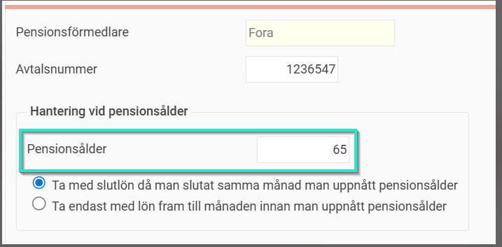

# Pensionsrapportering (årsvis) till Fora - Hur pensionsrapporterar jag tjänstemän till Fora i Flex HRM Payroll?

**Datum:** den 12 januari 2026  
**Kategori:** Payroll  
**Underkategori:** Löneberedning  
**Typ:** other  
**Svårighetsgrad:** advanced  
**Tags:** lön, löneart, pension  
**Bilder:** 10  
**URL:** https://knowledge.flexhrm.com/peinsonsrapportering-till-fora-hur-pensionsrapporterar-jag-till-fora-i-flex-hrm-payroll

---

Denna artikel beskriver hur du pensionsrapporterar tjänstemän till Fora årsvis i Flex HRM Payroll.
Skapa underlag
Komplettera
Ta bort underlag
Kontrollera underlaget
Inrapportering
Fördjupad information om hur underlaget skapas och beräknas
Löpande arbete för rapportering till Fora
I januari varje år ska man rapportera löneunderlag för tjänstemän till Fora.
Fr.o.m. 2026 ska lönesumman delas upp utifrån ålder i olika fält hos Fora.
För att få fram lönesumman för respektive grupp behöver du använda dig av en inställning under
Inställningar > Lön > Pension och försäkring
(inställningen finns tillgänglig i Flex HRM fr.o.m. version 2026.10).
Välj pensionsavtalet för Fora.
I fältet Pensionsålder anger du 65. Skapa underlaget (se instruktion nedan) och notera lönesumman som ska rapporteras i fältet för de upp till 65 år.
Ändra sedan inställningen till 66 och ta bort underlaget och skapa det på nytt för att få lönesumman upp till 66 år.

Skapa underlag
Skapa ett underlag för årets rapportering. Detta gör du genom att välja Rapportering till Fora och därefter klicka på knappen
Ny
i knappraden.
Här anger du vilket år löneunderlaget ska rapporteras för. Vid behov kan du även välja att göra urval på specifika anställda.

När du klickar på knappen
Skapa
påbörjas arbetet med att skapa underlag. När underlaget är skapat ser du underlaget med statusen satt som
Preliminär
i vyn.
Komplettera
Om du hittat ett fel i underlaget kan du beräkna om underlaget för alla eller ett urval av anställda genom att klicka på knappen
Komplettera
och där göra önskat urval.
Ta bort underlag
Vid behov kan du även ta bort ett underlag, eller en eller flera anställda, genom att klicka på
Ta bort
– antingen för att börja om från början eller om du inte längre vill spara underlaget.
Kontrollera underlaget
Nästa steg är att kontrollera underlaget. Detta gör du genom att granska underlaget i vyn.
Överst i vyn väljer du vilken rapportering (om du har fler än Fora) samt vilken redovisningsperiod du vill titta på. Tidigare redovisningar finns kvar och är enkelt tillgängliga.

I listan visas underlaget för alla arbetare som sammanställts och som kommer med i filen till Fora.

Under listan av arbetare finns en sammanställning för arbetarnas och tjänstemännens totala löner. För tjänstemännen visas både en total lönesumma för alla tjänstemän samt en lönesumma för anställd VD.

För att kunna göra egna beräkningar på försäkringskostnaderna visas också hur stor del av lönen som överstiger 7,5 prisbasbelopp respektive 7,5 inkomstbasbelopp. Du kan också exportera underlaget till
Excel
för att få detaljerad information om vilka anställda som kommit med, inklusive information för tjänstemannalönerna.

När underlaget är granskat markerar du underlaget som kontrollerat genom att klicka på knappen
Markera som kontrollerad.
Statusen på underlaget ändras då till
Kontrollerad
, vilket innebär att underlaget nu är låst för ändringar. Datum, tid samt signatur för användaren som markerade underlaget som kontrollerat sparas ner på underlaget.

Om du hittar ett fel i ett kontrollerat underlag kan du ta bort kontrollmarkeringen igen. Då sätts statusen om till
Preliminär
, och du kan nu komplettera underlaget igen. När du därefter markerar underlaget som kontrollerat igen sätts en ny tidpunkt när underlaget blev kontrollerat för att du ska kunna se om filen som skickats in till Fora är skapad från det senast uppdaterade underlaget.
Inrapportering till Fora
Lönesumman för tjänstemän knappas in manuellt i Foras inrapporteringstjänst.

Fördjupad information om hur underlaget skapas och beräknas
Nedan hittar du detaljerad information om hur underlaget skapas i systemet.
Vilka anställda tas med i underlaget till Fora?
En anställd tas med enligt följande villkor:
Den anställde är markerad med kategorin Arbetare, Tjänsteman, eller Tjänsteman – Anställda VD.
Personnummer finns angivet för den anställde. För personer med flera anställningsnummer kommer dessa slås ihop om de tillhör samma kategori.
Om den anställde är över 65 år vid rapporteringsårets ingång krävs att den anställde har en markering för Avtalspension efter 65 år (SAF-LO).
Beräkning av löneunderlag
Den lön som rapporteras är summan av utbetald lön under rapporteringsåret. De lönearter som räknas med i underlaget är de som är markerade som Fora – Avser lön.
Om du har valt att ingående värde ska hämtas från en ackumulator hämtas ingående värde för gällande rapporteringsperiod.
För anställda som fyllt 65 år under rapporteringsåret gäller följande:
Om den anställde är en arbetare med överenskommen avtalspension efter 65 år räknas all utbetald lön under året.

För anställda som inte har avtalspension efter 65 år men fortsätter att jobba gäller att lön fram till månaden innan man fyllt 65 år rapporteras.
För anställda som inte har avtalspension efter 65 år och som slutar samma månad man fyller 65 år tillämpas regeln man valt i företaget.

Löneunderlaget summeras per personnummer under förutsättning att de olika anställningsnumren tillhör samma kategori. För anställda med delad tjänst där den ena ska räknas som arbetare och den andra som tjänsteman behöver man således lägga upp de olika tjänsterna med olika anställningsnummer.
Startdatum, slutdatum och uppmärkningskod
För anställda som börjat en anställning under rapporteringsperioden redovisas det första anställningsdatumet. För anställda som slutat rapporteras det sista slutdatumet.
För anställda som tillhört olika uppmärkningskoder under året redovisas det sista man tillhört.
Relaterade artiklar:
Vilka inställningar krävs för att göra årsvis rapportering till Fora i Flex HRM Payroll?
