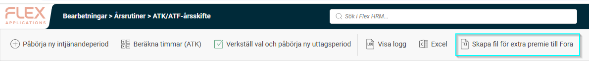
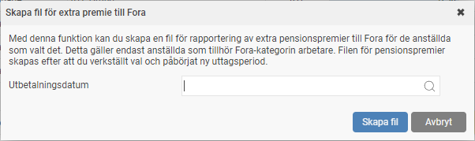
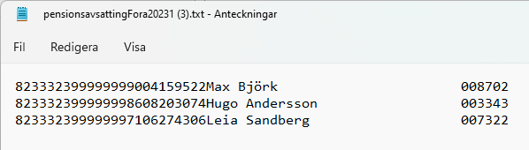
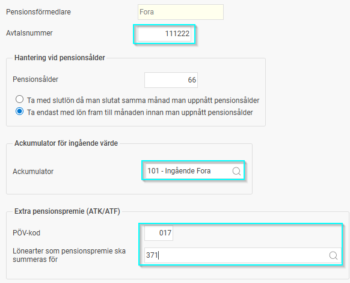
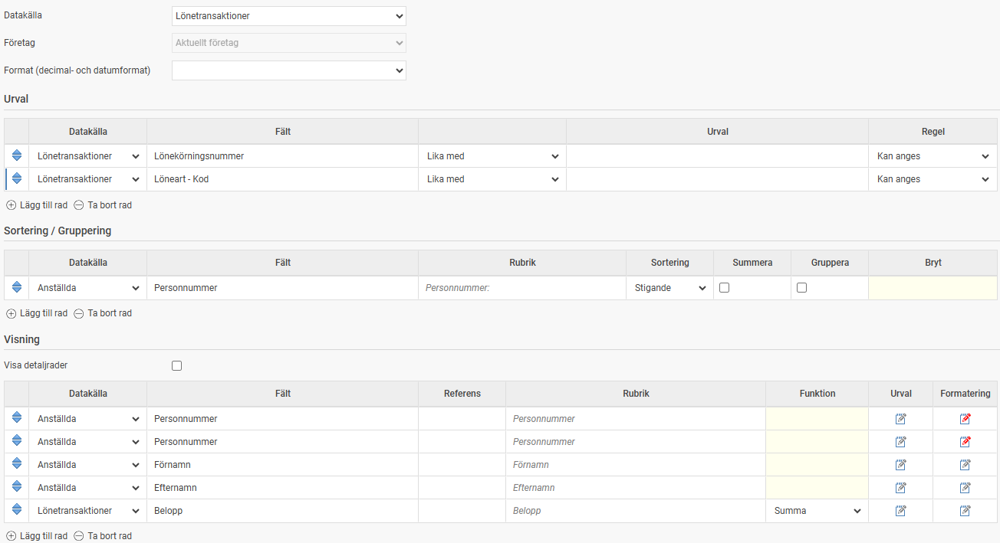
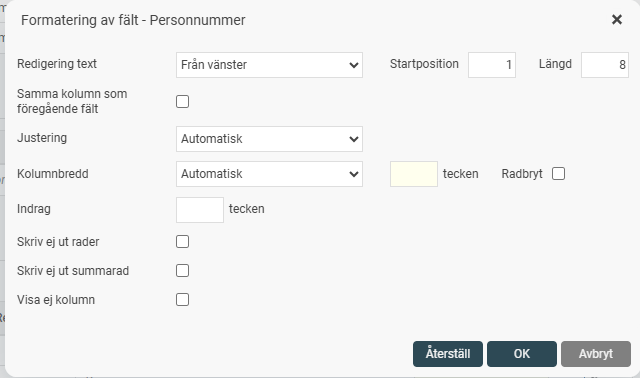
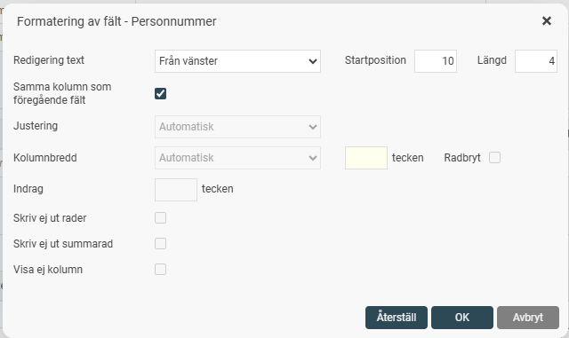
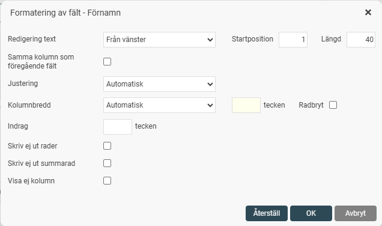
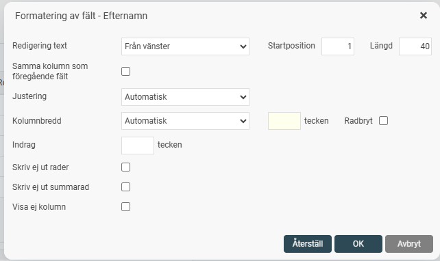

# Rapportering av kompletterande pensionspremier för arbetare till Fora

**Datum:** den 13 mars 2026  
**Kategori:** Payroll  
**Underkategori:** Pension  
**Typ:** other  
**Svårighetsgrad:** intermediate  
**Tags:** lön, löneart, pension  
**Bilder:** 9  
**URL:** https://knowledge.flexhrm.com/sv/rapportering-av-kompletterande-pensionspremier-f%C3%B6r-arbetare-till-fora

---

Inom vissa branscher finns det överenskommelser om att arbetsgivaren ska betala in kompletterande pensions­premier till tjänste­­pensionen för arbetare, utöver den vanliga premien till Avtals­pension SAF-LO. Denna artikel beskriver hur du kan hämta ut uppgifter från HRM Payroll för dessa typer av rapporteringar.
Arbetstidspension & Livsarbetstidspension
Extra pensionspremier
Deltidspensionsavsättning
Arbetstidspension & Livsarbetstidspension
Detta gäller dig som har ett kollektivavtal där man som anställd kan välja att avsätta intjänandet till extra pension och har tjänstepension via Fora. För att underlätta redovisningen till Fora för alla som valt extra pensionsavsättning finns möjlighet att skapa en fil för rapportering. Detta gäller för anställda som tillhör Fora-kategorin Arbetare.
Skapa fil
När den anställde har gjort sitt val för ATK/ATF och du kört rutinen för att verkställa val och påbörja ny uttagsperiod genererar systemet en lönetransaktion med beloppet som ska avsättas till pension i den preliminära lönekörningen (som en passiv löneart). När detta är klart kan du skapa en fil för extra premie till Fora genom att klicka på knappen i vyn för ATK/ATF-årsskifte.

Här väljer du sedan ett utbetalningsdatum som belopp för pensionspremien ska summeras för.

När du klickar på
Skapa fil
sammanställer systemet en fil innehållande alla med Fora-kategorin Arbetare. Filen laddas direkt ner i webbläsaren och sparas inte i systemet.
Filen som skapas är en textfil enligt Foras format för extra premier och kan se ut så här:

Inställningar
För att kunna skapa en fil till Fora krävs dessa inställningar under
Administration - Inställningar - Lön - Pension och försäkring.
Avtalsnummer
för Fora
PÖV-kod
Om du har en PÖV-kod behöver du ange den här. PÖV-kod är kod för pensionsöverenskommelse.
Lönearter som pensionspremier ska summeras för
Här anger du de lönearter som du använder för pensionspremie. Du måste ange minst en löneart, men kan välja flera. Detta är användbart om du enligt avtal ska avsätta en extra premie om man väljer avsättning till pension.

Rapportering av extra pensionspremier
Fora inför nya rutiner för hur extra pensionspremier ska rapporteras den 7 april 2026. För rapportering från HRM Payroll kan en excelfil skapas via Rapportgeneratorn förutsatt att beloppet som ska rapporteras lagts ut på en löneart (t.ex. en passiv löneart för "bonus - avsättning till pension" i en lönekörning  .  Excelfilen ska ha följande utseende:
A. Personnummer  - 12 tecken utan bindestreck.
B. Förnamn - max 40 tecken.
C. Efternamn - max 40 tecken.
D. Premiebelopp - utan några avskiljare mellan siffror.
Bilden nedan visar hur du bygger en rapportmall för detta i rapportgeneratorn. När rapporten dras behöver urval göras för aktuell lönekörning och de lönearter vars belopp ska rapporteras i filen.

Följande kompletterande inställningar behöver göras under visningsfälten för:
Personnummer - rad 1. För att hämta de första 8 siffrorna i personnumret görs följande inställning under Formatering:

Personnummer - rad 2. För att hämta de sista fyra siffrorna i personnumret och slå ihop dessa med de första 8 (utan bindestrecket) görs följande inställning under Formatering:

Förnamn - rad 3. För att säkerställa max 40 tecken görs följande inställning under Formatering:

Efternamn - rad 4. För att säkerställa max 40 tecken görs följande inställning under Formatering:

Deltids­pensions­avsättning
Genom att alla arbetare på företaget tilldelas en upp­märkningskod, vet Fora vilka som omfattas av en kompletterande pensions­premie. Premien beräknas på den lön som rapporteras in månatligen. Ingen separat upp­märkning eller rapportering behöver alltså göras.
