# Varningar i samband med ATK/ATF skifte och hur du hanterar dom

**Datum:** den 14 april 2026  
**Kategori:** Payroll  
**Underkategori:** Löneberedning  
**Typ:** other  
**Svårighetsgrad:** intermediate  
**Tags:** lön, löneart  
**Bilder:** 11  
**URL:** https://knowledge.flexhrm.com/sv/varningar-i-samband-med-atk/atf-skifte-och-hur-du-hanterar-dom

---

I denna artikel beskriver vi exempel på varningar som kan uppstå vid ATK/ATF årsskiftet och hur du hanterar dom i Flex HRM
Medarbetare med en gammal intjänandeperiod
I vyn för ATK/ATF-årsskifte ser du att några medarbetare inte flyttats till den nya intjänandeperioden när du initierar nytt år. I exemplet nedan har vi initierat ny intjänandeperiod från 2026-04-01. Medarbetarna vars intjänandeperioder är daterade före 2026-04-01 behöver åtgärdas.
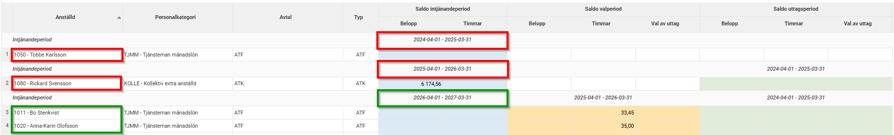
Om du försöker öppna en ny lönekörning för april 2026 utan att åtgärda dessa får du en varning och lönekörningen kan inte skapas.
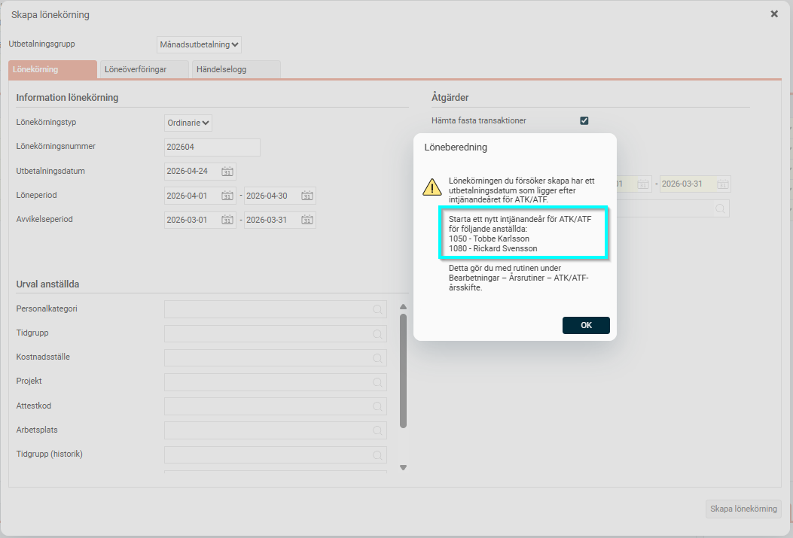
Detta kan bero på olika saker, att ett ATK/ATF avtal har lagts upp felaktigt (dvs medarbetaren skulle inte haft något intjänande alls) eller att medarbetaren bytt anställning och i den nya anställningen inte tjänar in ATK/ATF men det gamla avtalet har inte avslutats korrekt.
Exempel 1
Medarbetaren har felaktigt blivit upplagd med ett ATK/ATF avtal
Detta kan t.ex. hända om ni anställer medarbetare på en personalkategori som har ett standardavtal kopplat. Då avtalet initieras automatiskt räcker det inte att byta i avtalsfältet till
Ingen avtalad ATK/ATF.
Ser du fortfarande fälten med saldon för intjänandeperiod/valperiod och/eller uttagsperiod är avtalet aktivt och måste raderas.
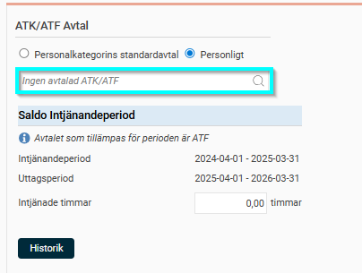
För att radera ett felaktigt initierat avtal behöver du aktivera en behörighet för att kunna ta bort ATK/ATF-år på din roll, i bildexemplet nedan har vi lagt på behörigheten på rollen Flexadministratör:
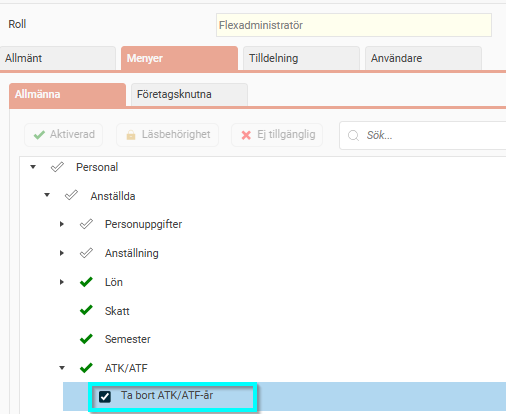
I anställdaregistret kan du nu på fliken ATK/ATF klicka på knappen Historik och längst till höger kan du sen klicka på krysset för att radera ett år.
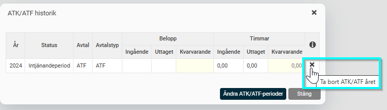
OBS. Detta raderar all data kopplat till det valda ATK/ATF året.
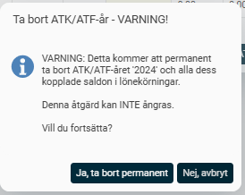
Exempel 2 Medarbetaren har återanställts och tjänar inte in ATK/ATF på den nya anställningen men avtalet är fortfarande aktivt
För att avsluta ett ATK/ATF avtal måste alltid slutlön köras och lönearterna för slutlön kopplade till avtalet måste läggas ut i en lönekörning. Om inget ska utbetalas får man nolla beloppen på lönearten men du måste låta lönearten ligga kvar i en lönekörning. Avtalet får då status Slutlön utbetald och det är ej längre aktivt.
I vårt exempel har anställd 1080 haft en anställningsperiod t.o.m. 2025-12-31 där han hade ett aktivt ATK avtal. I anställningen från 2026-02-02 har han ej rätt till intjänande av ATK eller ATF.
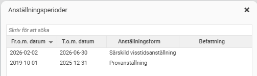
Under fliken ATK/ATF ser vi att systemet fortfarande tillämpar ATK-avtalet.
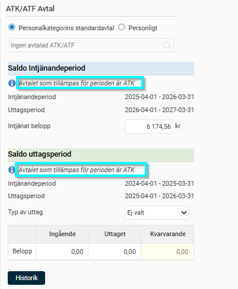
För att stänga avtalet behöver vi öppna en extra lönekörning i avtalsperioden. I mitt exempel väljer jag att öppna en extra lönekörning i mars 2026 som är den sista månaden i avtalets intjänandeperiod. Via funktionen för slutlön väljer jag den tidigare anställningsperioden och lägger endast ut lönearterna som hör till ATK-avtalet.
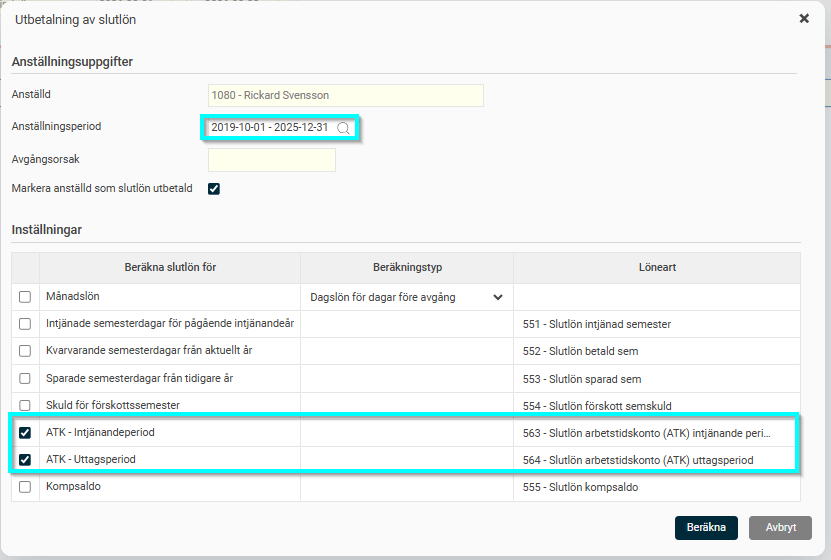
I löneberedningen nollar jag eventuella belopp som beräknats genom att sudda värdet i fältet Belopp. Här kan ni ha en eller flera lönearter beroende på om HRM anser att det finns ett belopp att utbetala på en eller flera perioder (intjänandeperiod/valperiod/uttagsperiod) för avtalet. Nolla samtliga raders belopp och låt de lönearter som skapats ligga kvar.
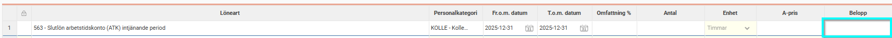
Jag avräknar lönekörningen. I anställdaregistret ser jag att ATK-avtalet har uppdaterats till Slutlön utbetald.
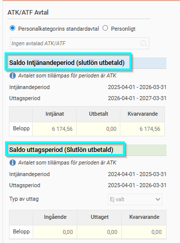
