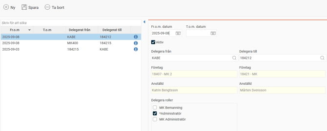

# Hur fungerar delegerad behörighet?

**Datum:** den 17 februari 2026  
**Kategori:** Systemgemensamt  
**Underkategori:** Användare & Behörighet  
**Typ:** howto  
**Svårighetsgrad:** intermediate  
**Tags:** användare, behörighet, roll  
**Bilder:** 1  
**URL:** https://knowledge.flexhrm.com/sv/kan-jag-se-en-%C3%B6versikt-%C3%B6ver-alla-delegerade-beh%C3%B6righeter

---

Användare kan delegera sin behörighet via
Min profil > Delegera användarbehörighet
.
Du ser en översikt över delegerade behörigheter i vyn
Användare/Behörigheter > Delegerade behörigheter
. Här kan du också redigera och skapa delegeringar.
I listan till vänster ser du aktuella delegeringar. Vill du se historiska delegeringar går det att välja. Du ser datum för delegeringen samt vilken användare som delegerat till vilken användare. Om du håller muspekaren över
infosymbolen
får du också information om vem som senast sparade delegeringen och när det gjordes.

Skapa nya delegeringar
För att skapa en ny delegering väljer du först vilken användare behörigheten ska delegeras
från
och sedan vilken användare du vill delegera
till
. Slutligen väljer du vilka roller du vill delegera.
Vilka roller du kan delegera styrs av inställningarna för tilldelning av roller. Du kan bara delegera de roller som du själv har behörighet att tilldela. Du kan läsa mer om behörighet att tilldela roller i artikeln
Vad är en roll?
Redigera delegeringar
Du kan bara redigera delegeringar som har gjorts av användare som du har tillgång till. Däremot kan du se delegeringar som andra användare har gjort, om de är gjorda till en användare som du har tillgång till.
Observera att behörighetsinställningar kan göra att du inte ser alla delegerade behörigheter.
Vad händer med en delegering om behörigheten ändras?
En delegerad behörighet gäller till sitt slutdatum. Den gäller på det vis den sparades vid delegeringstillfället. Det innebär att om den person som delegerat sin behörighet får ändrade inställningar efteråt, påverkar det inte den befintliga delegeringen.
Exempel
Användare A är attestant till alla anställda med hemkostnadsställe 1.
Användare A delegerar sin attestroll till användare B, vilket gör att även användare B kan attestera alla anställda med hemkostnadsställe 1.
Användare A byter tjänst och är istället attestant för hemkostnadsställe 2.
Delegeringen till användare B är sparad som den var vid delegeringstillfället. Användare B är alltså fortfarande attestant för hemkostnadsställe 1. Han påverkas inte av ändringen som gjordes för användare A.
Vi rekommenderar att du alltid sätter ett slutdatum för delegerad behörighet. Vill du ge en behörighet löpande bör du istället ändra i användarregistret.
Relaterat
Vad är en roll?
Kan jag delegera min attestbehörighet tillfälligt till någon annan när jag är ledig?
