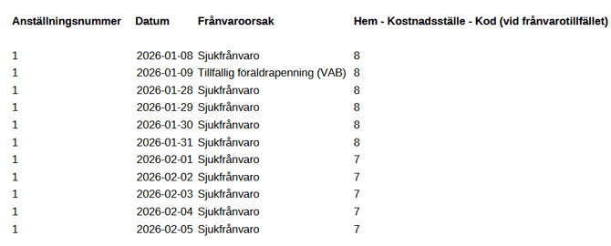

# Kan jag ta ut information om frånvaro i rapportgeneratorn?

**Datum:** den 2 februari 2026  
**Kategori:** Time  
**Underkategori:** Frånvaro & Semester  
**Typ:** faq  
**Svårighetsgrad:** intermediate  
**Tags:** frånvaro, schema, tidrapport  
**Bilder:** 1  
**URL:** https://knowledge.flexhrm.com/sv/kan-jag-ta-ut-information-om-fr%C3%A5nvaro-i-rapportgeneratorn-

---

Du kan ta fram anpassade rapporter över alla typer av frånvaro i HRM Time med hjälp av datakällan Frånvaro i Rapportgeneratorn.
Tillgängliga fält och urval
Vilken frånvaro visas i rapporten?
Konteringar i datakälla frånvaro
Ta hänsyn till återinsjuknande
Med datakällan
Frånvaro
kan du ta fram olika uppgifter för att få en tydlig översikt. Du kan till exempel:
Se hur många frånvaroperioder en anställd har haft under det senaste året.
Ta reda på hur stor andel av sjukfrånvaron som är
korttidsfrånvaro
.
Du kan
kombinera
datakällan
Frånvaro
med datakällan
Anställda
. Detta gör att du kan skapa mer detaljerade rapporter och göra urval baserat på till exempel
avdelning
,
kön
eller
ålder
.
Tillgängliga fält och urval
För datakällan
Frånvaro
finns följande fält tillgängliga för rapporter och urval:
Antal dagar totalt i frånvaroperiod
(arbetsdagar)
Antal dagar totalt i frånvaroperiod
(kalenderdagar)
Antal frånvaroperioder
Antal timmar frånvaro
Barn - Identifikationsnummer
Barn - Namn
Dag i frånvaroperiod
(arbetsdagar)
Dag i frånvaroperiod
(kalenderdagar)
Datum
Deltidsfrånvaro
Deltidsfrånvaroprocent
Fr.o.m. klockslag
Fr.o.m. klockslag
(inkl. dygnsbryttecken)
Frånvaroorsak
Frånvaroperiod i datumurvalet
Första datum i frånvaroperiod
Hem - Kontering - Kod (vid frånvarotillfället)
Hem - Kontering - Namn (vid frånvarotillfället)
Kontering - Kod
Kontering - Namn
Meddelande
Omfattning
Schematid
(timmar)
Schematid heltid
(timmar)
Sista datum i frånvaroperiod
T.o.m. klockslag
T.o.m. klockslag
(inkl. dygnsbryttecken)
Datakällan
Frånvaro
kommer att utökas med fler funktioner.
Vilken frånvaro visas i rapporten?
Rapporten hämtar frånvaro från tidrapportens frånvarohanterare. Frånvarotidrader som endast skrivits in direkt i tidrapporten kommer alltså inte med.
Finns det flera frånvaroposter för samma tidpunkt hämtar rapporten enligt samma logik som tidrapporten. Du kan läsa mer om det i denna artikel:
Vilken frånvaro gäller när det finns överlappande frånvaroposter?
Konteringar i datakälla frånvaro
Frånvarokontering
Det går att kräva att konteringar (kostnadsställe, projekt etc) anges för frånvaro. Det används om ni vill att konteringar från frånvaroansökan ska läggas ut i tidrapporten eller om ni vill att frånvaroansökan ska granskas av den som är behörig att granska konteringen istället för av den som är den anställdes chef.
Läs mer om frånvarokonteringar här:
⚙️
Kan delattestbehörighet användas för frånvarogranskning?
Använder ni kontering på frånvaro kan ni få ut dessa konteringar i rapportgeneratorn.
Hemkontering
Den anställdes hemkonteringar finns i anställdaregistret, fliken
Kontering
.
I rapporter och statistik görs urval på hemkontering på den kontering som gäller det datum rapporten/statistiken tas ut.
Datakällan Frånvaro är ett undantag.
Här kan du göra urval på/visa den hemkontering som gällde det datum frånvaron inträffade.
Exempel:
Anställd 1 tillhörde kostnadsställe 8 i januari och kostnadsställe 7 i februari.
Rapporten visar hemkostnadsställe utifrån datum, INTE vad den anställde har idag.

Ta hänsyn till återinsjuknande
En viktig funktion är möjligheten att ta hänsyn till
återinsjuknande
.
Om du aktiverar den här inställningen i urvalet för rapporten, behandlar systemet flera frånvaroperioder som
en enda period
om en anställd återinsjuknar inom fem dagar. Det är praktiskt för att få fram korrekt statistik som stämmer överens med hur
karens
beräknas.
Relaterat
Vad är Rapportgeneratorn?
Kan delattestbehörighet användas för frånvarogranskning?
Vilken frånvaro gäller när det finns överlappande frånvaroposter?
