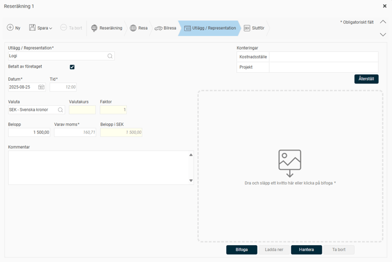

# Hur rapporterar jag utlägg och representation i HRM Travel?

**Datum:** den 16 februari 2026  
**Kategori:** Travel & Expense  
**Underkategori:** Utlägg & Kvitton  
**Typ:** howto  
**Svårighetsgrad:** intermediate  
**Tags:** bil, kvitto, utlägg  
**Bilder:** 5  
**URL:** https://knowledge.flexhrm.com/sv/hur-rapporterar-jag-utl%C3%A4gg-och-representation

---

Hur rapporterar jag privata utlägg och representation i HRM Travel samt bifogar kvitton på gjorda utlägg?
Så här lägger du till ett utlägg
Utlägg
används när du betalat något för företagets räkning med egna pengar och ska ha ersättning för det. Det kan gälla allt från
friskvård
till
kontorsmaterial
eller
parkeringsavgifter
. För att registrera ett nytt utlägg börjar du med att fylla i de olika fälten. Vissa fält är specifika för vissa typer av utlägg.
Börja med att välja typ av utlägg. Observera att vissa utläggskoder har en förinställd momssats. Denna används för att beräkna momsen utifrån det belopp du anger. Det beräknade momsvärdet visas som grå och kursiv text. Om det inte stämmer med momsen på ditt kvitto kan du ange rätt värde.

Utlägg i annan valuta
Om du lägger till ett utlägg i en annan valuta hämtas valutakursen automatiskt för det datum då utlägget gjordes. Du ska alltid ange beloppet i den valuta som användes vid köpet.

Lägg till en bilaga
Du kan enkelt koppla en digital bilaga till ditt utlägg.
Klicka på
Bifoga
för att välja en fil, eller dra och släpp filen direkt in i systemet.
Bilder visas direkt. Bilagor i andra format, som PDF-filer, kan du behöva ladda ner för att kunna öppna dem.

Syfte och deltagare
Om du har valt Representation måste du fylla i fälten för syfte och deltagare.

Om den här informationen redan finns i systemet kan du bocka i rutan
deltagare ska redovisas separat
. Då redovisas deltagarna separat i en bilaga.

Valet
Kopiera deltagarlista
kan underlätta om deltagarlistan är samma som för en tidigare representation. Du kan välja att kopiera från dina tio senaste registreringar av representation med deltagarlista. Har du angivit några deltagare manuellt, och sedan väljer att kopiera från en tidigare representation fylls listan på med de kopierade. Det redan angivna skrivs inte över.
