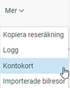
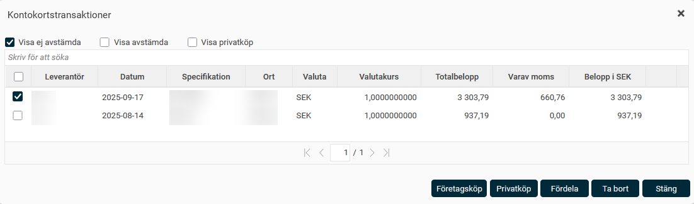
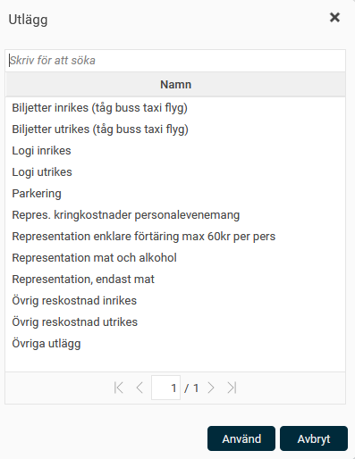
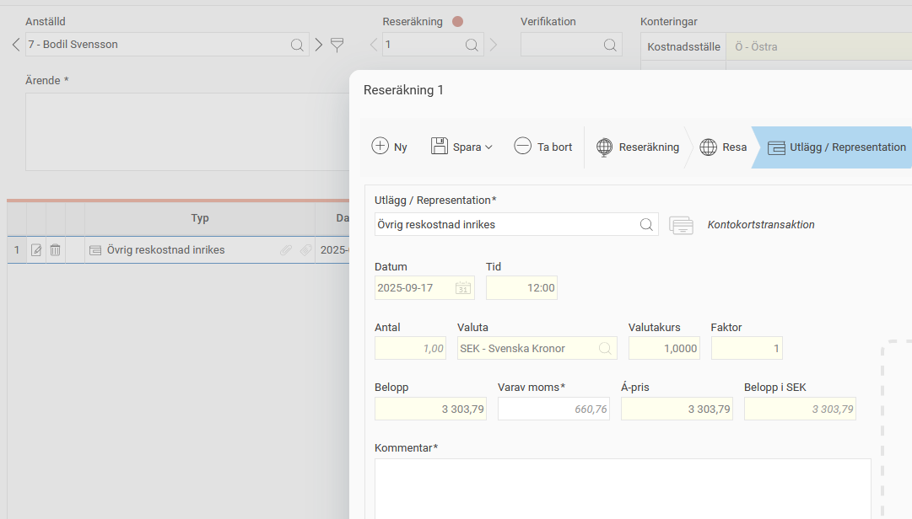
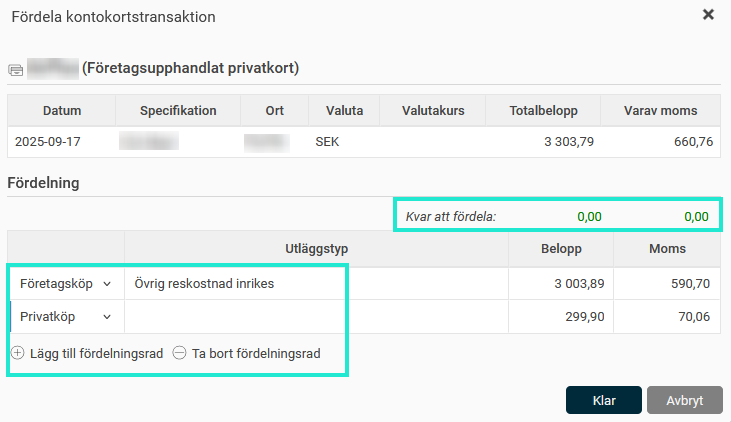

# Hur registrerar jag en kontokortstransaktion?

**Datum:** den 3 mars 2026  
**Kategori:** Travel & Expense  
**Underkategori:** Reseräkningar  
**Typ:** howto  
**Svårighetsgrad:** intermediate  
**Tags:** bil, utlägg  
**Bilder:** 5  
**URL:** https://knowledge.flexhrm.com/sv/utl%C3%A4gg-hur-registrerar-och-hanterar-man-utl%C3%A4gg-och-representation

---

Hur registrerar jag en kontokortstransaktion och kopplar den mot rätt utläggskod?
Utlägg eller representation från kontokortstransaktion
Finns det en koppling till kontokort för den anställde finns det en funktionsknapp för detta. Klicka på
Mer
och
Kontokort
för att visa alla inlästa kontokortstransaktioner.

Markera den transaktion som du vill hämta in.

Välj om transaktionen i fråga är ett företagsköp eller ett privatköp. Vid val av Privatköp tas transaktionen bort från Ej avstämda transaktioner. Väljer du istället Företagsköp kommer nästa val, där transaktionen ska kopplas samman med korrekt utläggstyp. I vissa uppsättningar där man använder sk MCC-koder så behöver man inte välja utläggstyp utan transaktionen kopplas direkt mot korrekt utläggskod.
Välj den utläggskod som motsvarar kontokortstransaktionen.

Transaktionen försvinner från listan över ej avstämda transaktioner och landar istället i reseräkningen.

Fördela en transaktion på flera varianter
Om en transaktion innehåller både privat kostnad och företagets kostnader kan transaktionen fördelas. Klicka på knappen
Fördela
och fyll i hur mycket av transaktionen som ska fördelas på respektive typ. I exemplet nedan där användaren har ett företagsupphandlat privatkort kan transaktionen fördelas på privat- och företagsdel. (Observerat att detta inte är möjligt med ett företagskort).  Systemet hjälper till med att tala om hur mycket som är kvar att fördela, så att inget belopp tappas bort.

Fördelningen kan också göras mot två olika utläggskoder om det är så att hela beloppet inte är av samma kostnadstyp.
Ta bort en avstämd transaktion
Om en transaktion använts felaktigt i en reseräkning går det bra att ta bort hela utlägget. Dubbelklicka på transaktionen i reseräkningens sammanställning så att det öppnas i en popup, och välj sedan
Ta bort
. Kontokortstransaktionen finns sedan åter som en ej avstämd transaktion.
