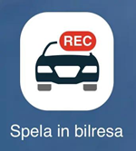
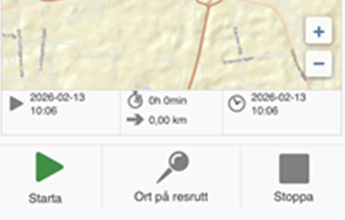
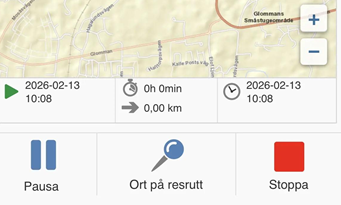
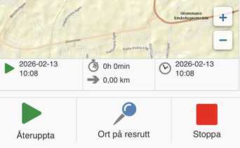

# Kan jag spela in min bilresa i HRM Mobile?

**Datum:** den 13 februari 2026  
**Kategori:** Travel & Expense  
**Underkategori:** Reseräkningar  
**Typ:** faq  
**Svårighetsgrad:** advanced  
**Tags:** bil, mobil, resa  
**Bilder:** 4  
**URL:** https://knowledge.flexhrm.com/sv/kan-jag-spela-in-min-bilresa-i-hrm-mobile

---

Spela in bilresa kan användas istället för att registrera bilresor manuellt.
I HRM Mobile finns funktionen
Spela in bilresa
som du kan använda istället för att registrera din bilresa manuellt. Du startar inspelningen när du startar bilresan, och avslutar inspelningen när du avslutar bilresan. När du sparar inspelningen hamnar den i din reseräkning/körjournal.
Starta och pausa inspelningen
1. Välj ikonen
Spela in bilresa
.

2. Kontrollera att GPS-signalen är bra.
När du startar en inspelning visar telefonen hur stor noggrannhet GPS:en har för tillfället. Tänk på att det kan ta en stund för telefonen att hitta din position.
Resan registreras utifrån den information som telefonen ger. Om telefonen förlorar sin GPS-signal kan det påverka hur resan ser ut på kartan och i beräkningen. Eftersom vi inte kan påverka själva GPS-positioneringen rekommenderar vi att du stämmer av mätarställningen när du reser.
3. Klicka på
Starta
och kör iväg.
HRM Mobile kommer att visa din resa med en blå linje på kartan.

4. Om du har flera stopp på vägen mot din slutdestination kan du använda knappen
Pausa
.

5. När du fortsätter färden klickar du på
Återuppta
för att fortsätta registrera resan.

Avsluta och spara
När du har nått ditt mål är det dags att slutföra registreringen.
Klicka på
Stoppa
när resan är klar.
Kontrollera att alla uppgifter stämmer.
Klicka på
Spara
.
Inspelningen sparas nu som en ny bilresa i din reseräkning eller körjournal.
Relaterat:
Vad krävs för att spela in bilresa i HRM Mobile?
