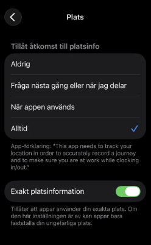

# Vad krävs för att spela in bilresa i HRM Mobile?

**Datum:** den 13 februari 2026  
**Kategori:** Travel & Expense  
**Underkategori:** Reseräkningar  
**Typ:** other  
**Svårighetsgrad:** intermediate  
**Tags:** bil, mobil, resa  
**Bilder:** 1  
**URL:** https://knowledge.flexhrm.com/sv/vad-kr%C3%A4vs-f%C3%B6r-att-spela-in-bilresa-i-hrm-mobile

---

Inställningar att kontrollera vid problem att spela in bilresa.
I HRM Mobile finns funktionen
Spela in bilresa
som du kan använda istället för att registrera din bilresa manuellt. Du startar inspelningen när du startar bilresan, och avslutar inspelningen när du avslutar bilresan. När du sparar inspelningen hamnar den i din reseräkning/körjournal.
För att spela in bilresa ska fungera bra behöver du tänka på följande:
HRM Mobile stöder den senaste versionen av iOS och versioner av Android som fortfarande underhålls med uppdateringar från tillverkaren.
Du måste i din mobila enhet tillåta att HRM Mobile får tillgång till platsinfo. Vi rekommenderar att tillåta plats “Alltid” (vissa mobiler har dock inte denna inställning, utan kan endast tillåta när appen används).
Tillåt exakt platsinformation.
Stäng inte av appen medan inspelning pågår.
Kontrollera den mobila enhetens inställning för batterioptimering. Batterioptimering kan göra att appar inte får köra i bakgrunden, vilket kan påverka inspelningen av bilresa negativt.
Har du problem att spara din inspelade bilresa? Kontrollera att du har Internetuppkoppling. Om du till exempel avslutar resan i ett garage med dålig mottagning kan du behöva lämna garaget för att kunna spara.

Relaterat:
Kan jag spela in min bilresa i HRM Mobile?
