# ⚙️Vilka inställningar behöver jag aktivera i HRM Travel & Expense för att hantera bilar med Drivmedelsförmån?

**Datum:** den 29 december 2025  
**Kategori:** Travel & Expense  
**Underkategori:** Reseräkningar  
**Typ:** config  
**Svårighetsgrad:** advanced  
**Tags:** bil, resa  
**Bilder:** 19  
**URL:** https://knowledge.flexhrm.com/sv/vilka-inst%C3%A4llningar-beh%C3%B6ver-jag-aktivera-i-hrm-travel-expense-f%C3%B6r-att-hantera-bilar-med-drivmedelsf%C3%B6rm%C3%A5n

---

Förutsättningar
Definition förmånsbilar
Med förmånsbil avser vi här en tjänstebil där drivmedlet betalas av företaget och den anställde blir förmånsbeskattad på de privat körda milen med drivmedelsförmån.
Fliken Bilar i Personalregistret
Den anställde måste ha en bil som är ikryssad med ”Drivmedelsförmån”. Det är även tvingande att ange Körjournal fr.o.m, Reg-nummer samt ingående mätarställning (km).
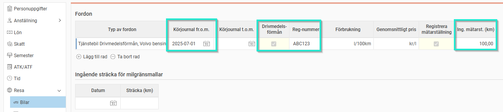
För att systemet ska veta hur förmånsvärdet ska beräknas måste beräkningssätt ställas in under Inställningar – Resa – Bilresor - Generellt
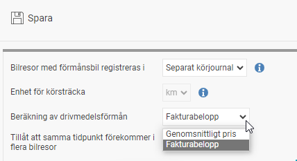
Fakturabelopp
Om Fakturabelopp används kan förmånsvärdet variera lite månad för månad, beroende på inköp och antal privata mil. Däremot blir det ju alltid rätt sett ur faktisk kostnad. Med detta beräkningssätt kommer systemet att räkna ut förmånsvärdet enligt formeln Antal privata milTotal antal körda mil×Fakturabelopp x 1.2. Således krävs att fakturabeloppet för perioden har matats in innan fullständig avräkning av bilen kan göras.
Genomsnittligt pris/l
Används Genomsnittligt pris tittar systemet på de värden som är angivna för bilens förbrukning och genomsnittligt pris/l i Personalregistret.
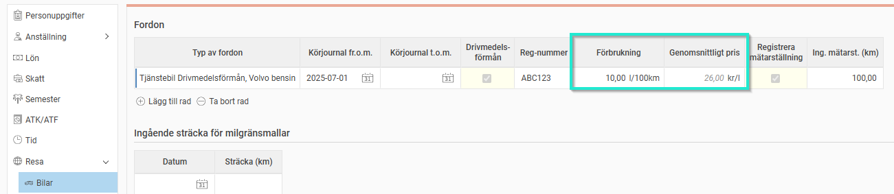
Om företaget har många tjänstebilar av samma typ med samma förbrukning kan man ange priset på respektive fordonstyp. Detta för att slippa ändra på flertalet anställda med samma biltyp. Under Inställningar – Resa – Bilresor - Fordonstyper kan man ange olika priser per månad som då slår igenom på alla anställda som är kopplade till denna fordonstyp
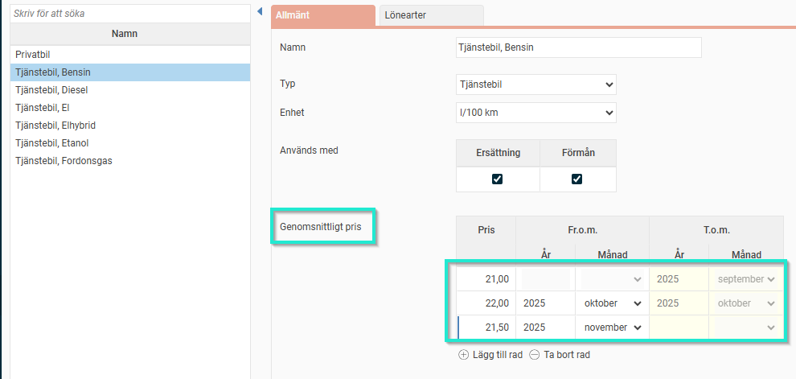
Registrera körda mil
Man kan välja vart man vill registrera sina bilresor med förmånsbil. Väljer man Körjournal är det enbart i denna vy man kan registrera bilresor. Vid valet ”Transaktionsvy” är det enbart i den vanliga reseräkningsvyn man kan registrera sina bilresor. Vid valet Transaktionsvy kan man trots det se sina bilresor i vyn Körjournal men inte ändra/ta bort eller skapa en ny.
Gör valet under Inställningar – Resa - Bilresor – Generellt
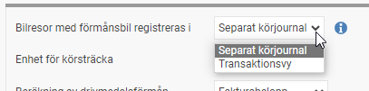
Transaktionsvy
Här rapporteras de körda milen som vanligt i en reseräkning. Har den anställde mer än en bil gäller det att välja rätt bil. Om det bara finns en förmånsbil angiven i personalregistret kommer den att användas som default.
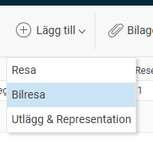
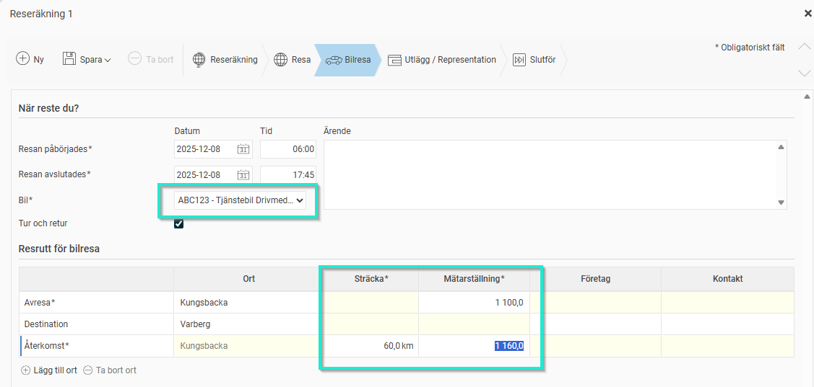
När sträckan matas in ändras automatisk utgående mätarställning. Det går bra att ange utgående mätarställning i stället och då räknas sträckan fram automatiskt.
När alla månadens resor är rapporterade är det viktigt att alla reseräkningar som har körda mil i perioden är klarmarkerade innan avräkning av förmånsbil kan ske.
Separat Körjournal
I vyn Körjournal väljer man först rätt bil och sedan rätt datumintervall innan man börjar registrera en ny bilresa.
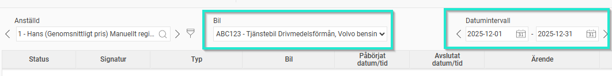
Klicka på Ny för att starta registreringen av en ny bilresa. Fyll i uppgifterna och spara.
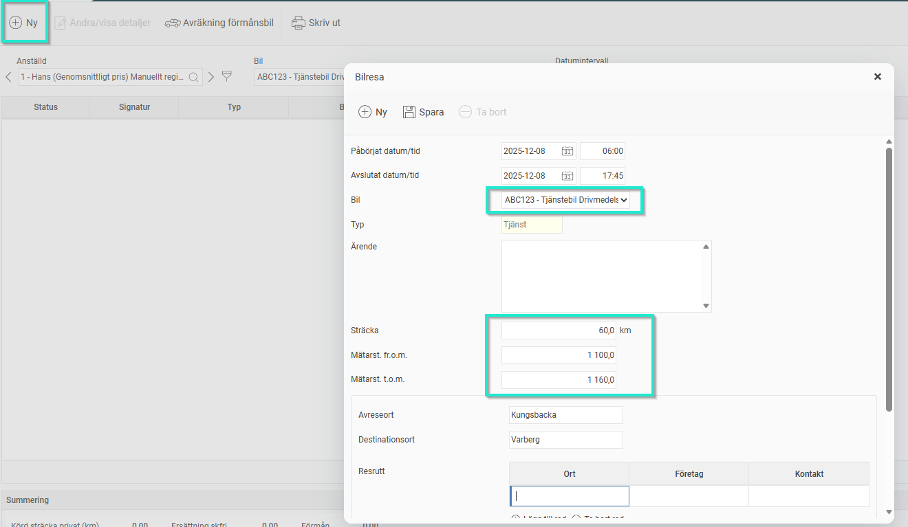
När alla månadens resor är rapporterade är det viktigt att alla reseräkningar som har körda mil i perioden är klarmarkerade innan avräkning av förmånsbil kan ske.
Avräkning
Registrera utgående mätarställning – Avräkning förmånsbil
Den anställde kan själv avräkna sin förmånsbil och klarmarkera den. Innan avräkningen sker bör fakturabeloppet ha angivits för perioden för att säkerställa att det blir ett förmånsvärde på de privata milen. Saknas fakturabeloppet går det ändå bra att klarmarkera.
Oavsett vilken vy man har registrerat sina bilresor i (transaktionsvyn eller körjournalsvyn) så görs registreringen av utgående mätarställning och avräkningen i Körjournalsvyn
Börja med att välja den bil som ska avräknas. Ange utgående mätarställning per den siste i den aktuella månaden. Spara och klarmarkera. Saknas fakturabelopp ges en varning om detta.
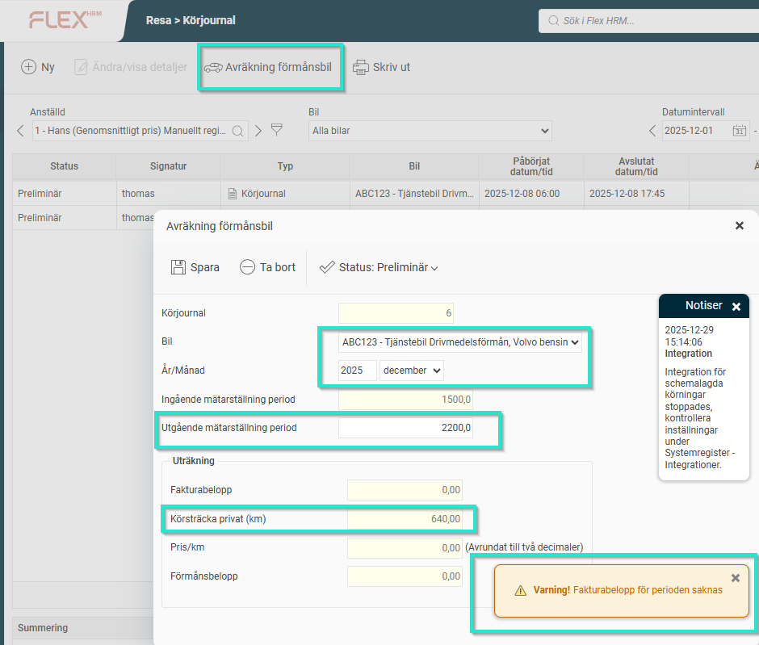
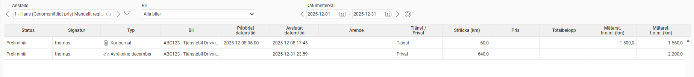
Registrera Fakturabelopp
För att färdigställa avräkningen behöver administratören ange fakturabeloppet för perioden under Bearbetningar - Registrering av drivmedelsfakturor.
Skapa en ny faktura genom att klicka på ”Mata in nya drivmedelsfakturor”.
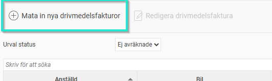
Alla anställda med förmånsbil dyker upp i massregistreringen. Ange rätt fakturabelopp till rätt anställd och klicka på Utför.
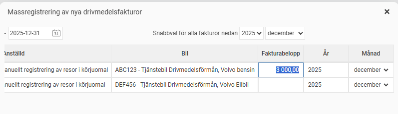
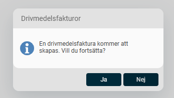
Klicka Ja
Avräkningen är slutförd och en drivmedelsförmån har skapats
Förmånsbeloppen registreras mot de lönearter man angivit under Inställningar – Resa – Bilresor - Fordonstyper
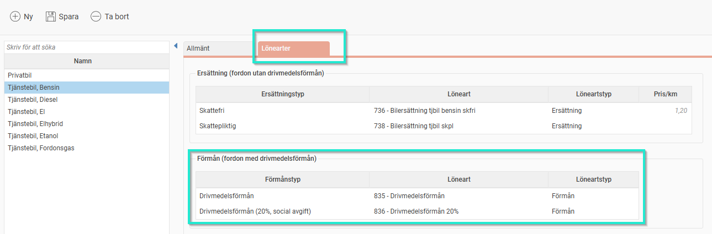
Attest av Körjournalen
I attestvyn syns en ikon för körjournalen för den anställde.
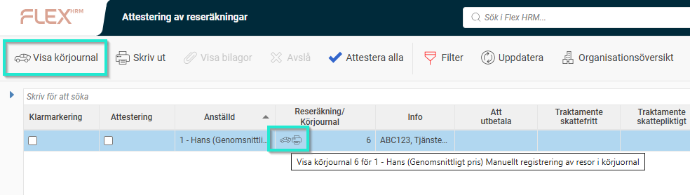
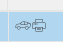
Klicka på ikonen för att kontrollera körjournalen. Om fakturabeloppet är inmatat ser vi nu värden i Summering. Klicka på ”Avräkning förmånsbil” för attest/godkännande alternativt gå tillbaks till attestvyn och attestera/godkänn där
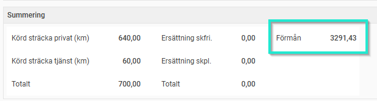
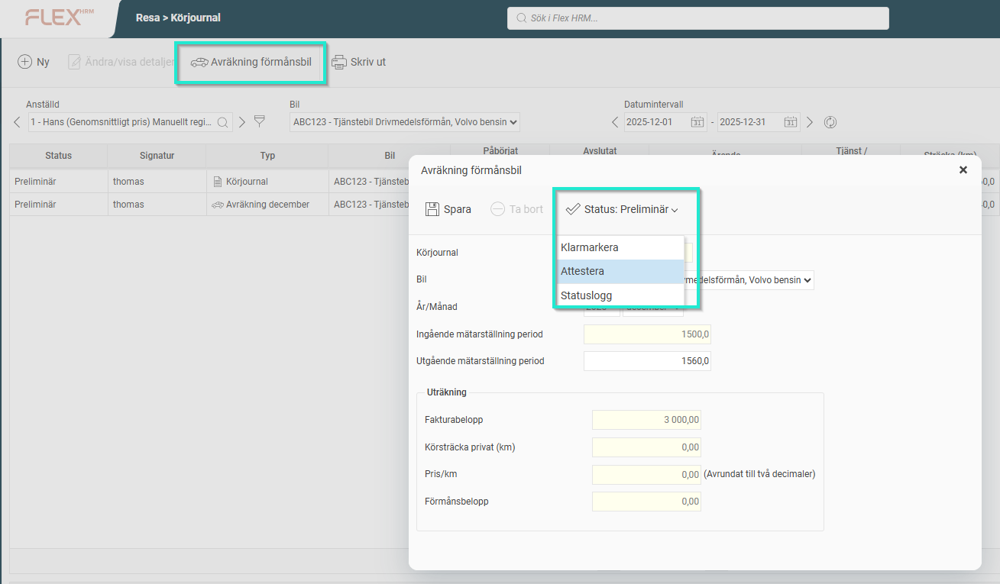
