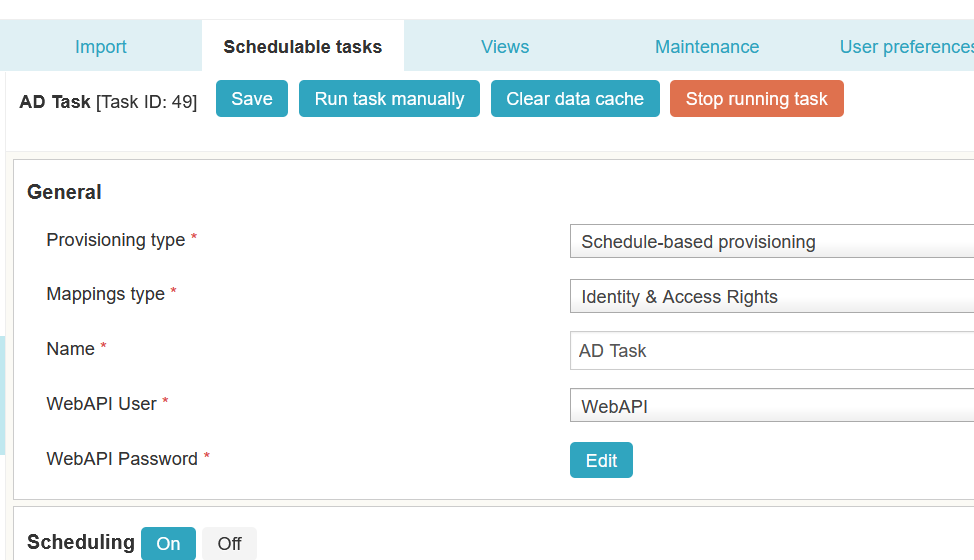

# EPE: possibility stop scheduled-based task from the UI.

**Källa:** https://community.efecte.com/t/y4hn87s/epe-possibility-stop-scheduled-based-task-from-the-ui
**Publicerad:** 2022-08-12T06:54:00.000Z
**Uppdaterad:** 2022-11-28T06:09:49.780000
**Författare:** 

---

EPE: possibility stop scheduled-based task from the UI.

      
    
          
      

        
              Tuija Länsisalmi
            

            
              Tuija_Lansisalmi
            updated 3 yrs agoMon, November 28, 2022 at 6:09 AM GMT+1
  

           Released
        

        
    

      
          

    
        
        
        
      

    

   User story:  
 As a Efecte provisioning engine admin, I want to stop scheduled based provisioning via ESM's user interface if it's stuck. This function gives the admin more management possibilities for the EPE.  
 ACs:  
 
 It's possible to stop scheduled based provisioning (running) from the ESM UI.   

          
    
        EPE
      
    
        IGA
      
    
  
  Vote
  Follow
    
            1

## Bilder

