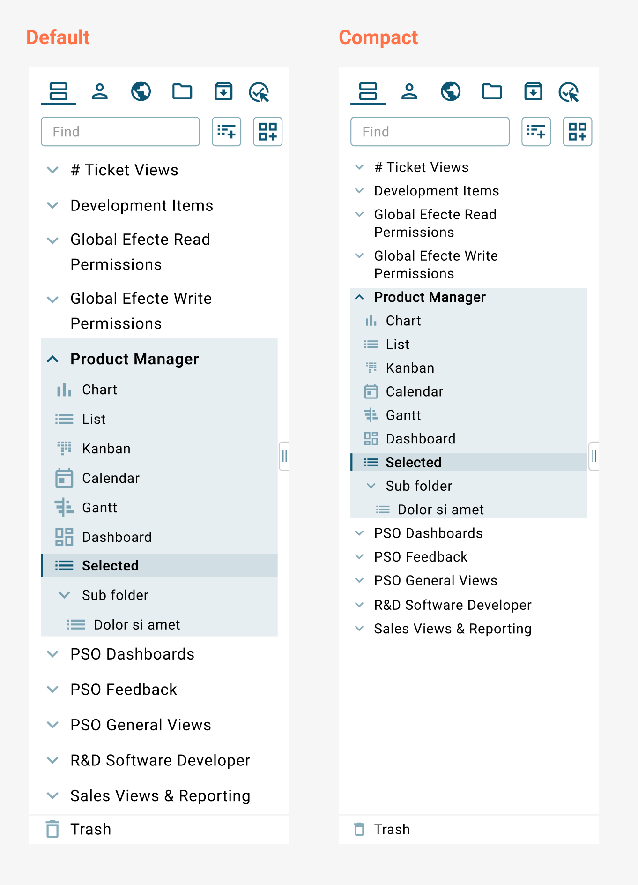

# ESM: Navigation Compact Mode

**Källa:** https://community.efecte.com/t/35h7pl7/esm-navigation-compact-mode
**Publicerad:** 2022-09-29T12:44:59.830Z
**Uppdaterad:** 2022-10-24T09:19:42.710000
**Författare:** 

---

ESM: Navigation Compact Mode

      
    
          
      

        
              Nick BoettcherEfecte Employee
            

            Efecte Product Designer
              Nick_Boettcher
            updated 3 yrs agoMon, October 24, 2022 at 9:19 AM GMT+2
  

          

        
    

      
          

    
        
        
        
      

    

   I’m happy to announce that in the Q4 upgrade to ESM we will include a Compact layout version for the updated Navigation panel. This was a feature missing from the initial release, but for those who have their personal Layout setting set to Compact, you will automatically see the new Compact version when you log in after the upgrade.  
  
 Compact mode has less padding and smaller font size than the Default layout. If you have a lot of roles and views, then you will be able to see more of them in the interface without the need to scroll. Refer to the image to compare the differences. 
          
  Vote
  Follow
    
            3

## Bilder

