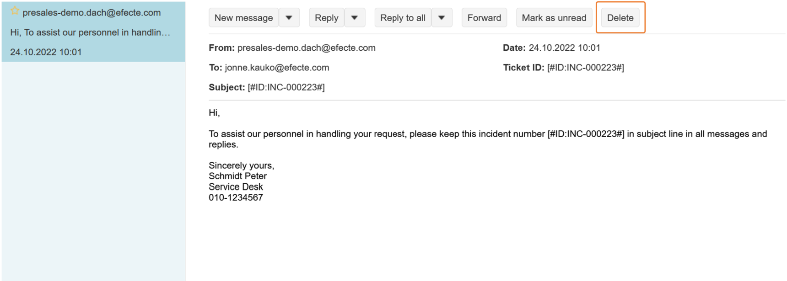

# ESM: Permanently delete an email

**Källa:** https://community.efecte.com/t/q6hmcqv/esm-permanently-delete-an-email
**Publicerad:** 2020-12-04T14:42:35.180Z
**Uppdaterad:** 2022-10-24T09:17:37.387000
**Författare:** 

---

ESM: Permanently delete an email

      
    
          
      

        
              Aki Koivukoski
            

            R&D
              Aki_Koivukoski
            updated 3 yrs agoMon, October 24, 2022 at 9:17 AM GMT+2
  

          5replies
        Jukka Jokinen2 yrs agoFri, February 10, 2023 at 8:10 AM GMT+1
  
        

        
    

      
          

    
        
        
        
      

    

   When we have the new UI for the emails, we plan to have a new feature that would allow the user to permanently delete individual email with attachments from the discussion.  
 UI should have a way to select the email to be deleted and a functionality to trigger the deletion with confirmation dialogue. More details later on.  Comments welcome! 
          
    
        Service Management Tool
      
    
  
  Vote
  Follow
    
            16

## Bilder

