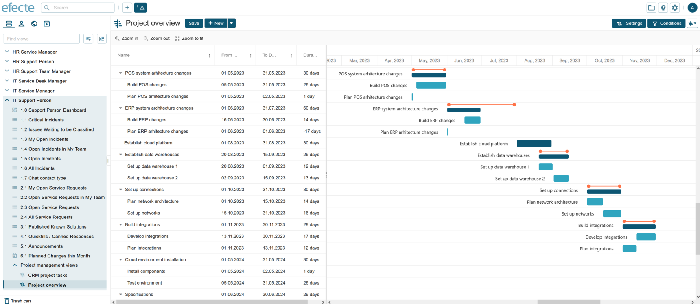
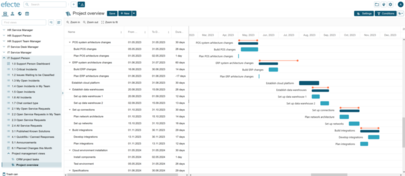
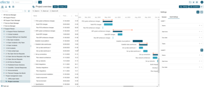

# ESM: Support for two templates in Gantt views

**Källa:** https://community.efecte.com/t/83h792a/esm-support-for-two-templates-in-gantt-views
**Publicerad:** 2022-10-24T06:54:50.953Z
**Uppdaterad:** 2022-10-24T08:54:50.953000
**Författare:** 

---

ESM: Support for two templates in Gantt views

      
    
          
      

        
              Jonne KaukoProduct Manager
            

            Senior Product Manager & Product Lead, M42 Core & Pro
              Jonne_Kauko
            3 yrs agoMon, October 24, 2022 at 8:54 AM GMT+2
  

          

        
    

      
          

    
        
        
        
      

     
          
          

  

   We're excited to tell you that the newly released Gantt view is getting a new feature! 🎉 The Gantt view launched in ESM 2022.3 introduced a possibility to visualize datacards in relation to a timeline. In the next release (2022.4), the Gantt view is brought to a new level – literally! Instead of visualizing a plain list of datacards, such as projects, users will be able to visualize a hierarchy on two levels. A common example would be to visualize a project portfolio along with their subprojects or tasks, or an individual project's subprojects and associated tasks.   
  
 The implementation for the second level support is based on the same flexible approach as the first level: the users can freely select which template's datacards to visualize, set the view conditions and define which attributes to be used for the parent-child relation (reference), the name (string) the start date (date or date & time with no handlers enabled), and the end date (date or date & time with no handlers enabled).  
  
 In other words, the second level is based on a relation between the parent level and child level. For example, a project can have a reference to a task. Therefore, the template for the second level is determined based on this relation – the user does not have to specify it separately. Multivalues are supported in the reference field (a project can have several tasks), but multi-template references are not supported (a project must refer to a single template – not for example a "project task" template and a "change task" template at the same time).  
  
 Another aspect to note when visualizing datacards with the Gantt view is related to the potential mismatch of the dates between a project's timeframe (start and end dates), and the timeframes of the project's subtasks. As the project has its dates, and the subtasks have other dates, it's possible to end up in a situation in which the subtasks' timeframes exceed the project's timeframe. The Gantt view includes a feature that supports the users in such cases: an orange-colored indicator is shown for the project timeline, whereas the dark blue bar indicates the actual length based on the subtasks' timeframes.  
          
  Vote
  Follow
    
            3

## Bilder

