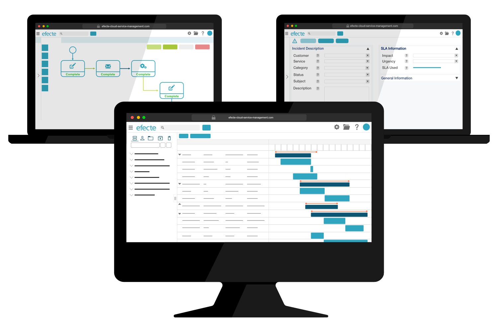

# Making Work Effortless: Efecte 2022.4

**Källa:** https://community.efecte.com/t/60hsk3s/making-work-effortless-efecte-2022-4
**Publicerad:** 2022-11-14T06:20:25.093Z
**Uppdaterad:** 2023-02-28T09:48:12.547000
**Författare:** 

---

Making Work Effortless: Efecte 2022.4

      
    
          
      

        
              Patrick Thurman
            

            Product Manager
              Patrick_Thurman
            updated 2 yrs agoTue, February 28, 2023 at 9:48 AM GMT+1
  

          

        
    

      
          

    
        
        
        
      

    

  ContentsEfecte 2022.4 HighlightsNew Products & SolutionsService Management CapabilitiesProvisioning Engine CapabilitiesSelf-Service CapabilitiesIn case you missed the news!Get the Complete Release Notes The 2022.4 release of Efecte will soon be available for all customers. This release's new functionalities help customers improve their service management and identity governance. In addition to the listed use cases, this release includes numerous improvements to increase performance, quality, and experience.  
Efecte 2022.4 Highlights 
New Products & Solutions 
 Improving the omnichannel experience: Solving end-users problems efficiently often requires various communication channels. We are happy to announce Efecte Chat for Service Management, our first new feature coming from our recent InteliWISE acquisition, is available! Efecte Chat for Service Management is our new chatbot and live chat solution for the Efecte Platform. Some key features include:  
 
 Multi-level rule-based chatbot to quickly solve common and repetitive problems or questions 
 Embedded live chat widget for agents in the Efecte Service Management Tool 
 Automatic ticket creation and escalation for incidents not solved in chat 
 
 A new self-service experience to meet changing demands: Self-service portals remain a key staple in the service management space, and users are demanding consumer-grade experiences from them. To meet this expanding need, we have been developing a new product Efecte Self-Service 2 (ESS2), designed with these users in mind. ESS2 is being developed in parallel with our current Efecte Self-Service (ESS) and has reached its first production release! ESS2 is only suitable for specific use cases and customers as we further expand the supported use cases and features. To find out more, look at Aki Ylivarvi and Nick Boettcher's presentation from Digitalize & Automate 2022 or contact your account manager.   
Service Management Capabilities 
 Managing projects has gotten a whole lot easier: Virtually all business and IT processes include some amount of multi-level task management. Our improved Gantt view will help teams, managers, and individuals stay on top of their projects and daily tasks. What have we improved with this new version?  
 
 The view creator now defines the two values used for the two-level hierarchy 
 Different visual indicators help users better understand tasks and project timeframes 
 
 Vast navigation panels are a thing of the past: Earlier this year, we updated our navigation panel to provide a new look and more functionalities. We have continuously improved and developed this new element to meet user needs, and we are happy to announce that the navigation panel now supports compact mode. The agent-enabled setting "compact mode" will now affect the navigation panel along with other UI elements to reduce whitespace.  
 Remove sensitive data when it's no longer needed: Agents can now delete an email, including the attachments, directly from the UI without deleting the entire request. This function helps organizations remove sensitive data after it is no longer necessary without compromising reporting statistics.  
Provisioning Engine Capabilities 
 Do even more without leaving our UI: Efecte Provisioning Engine (EPE) makes directory (i.e., AD) administrator lives a little easier. Now, these administrators can start and stop scheduled provisioning directly from our UI, often what is needed when tasks become stuck. Additionally, administrators can add users' photos from Efecte to their AD or Azure AD when creating or updating users.  
Self-Service Capabilities 
 Better serve your different service support channels: Certain services and channels can benefit from end-user comments, while others might not. This is often due to end-to-end automations that resolve an issue without human interaction leading to poor end-user experiences due to comments not being reacted to before a resolution. Now self-service administrators can enable and disable comments based on the support channel and request type.  
In case you missed the news! 
 This year we have had many new innovations, developments, and partnerships that will help many of our customers get the most out of Efecte. A few we would like to highlight are:  
 
 Reduce cyber security threats in our remote-work world with strong authentication powered by Signicat. 
 Do more with your data and create complex reports to better visualize your data using our Microsoft Power BI. More informaiton and templates coming soon to the Efecte Community. 
 Get even more out of your CMDB with Device42 to enable enhanced asset discovery and tracking. 
 
Get the Complete Release Notes 
 To read about all of the features, improvements, and bug fixes included in this release, please see the complete release notes from Efecte Docs. Please get in touch with our service desk if you cannot access the community or have questions about upgrading. 
          
    
        Release Documentation
      
    
  
  Vote
  Follow
    
            3

## Bilder

