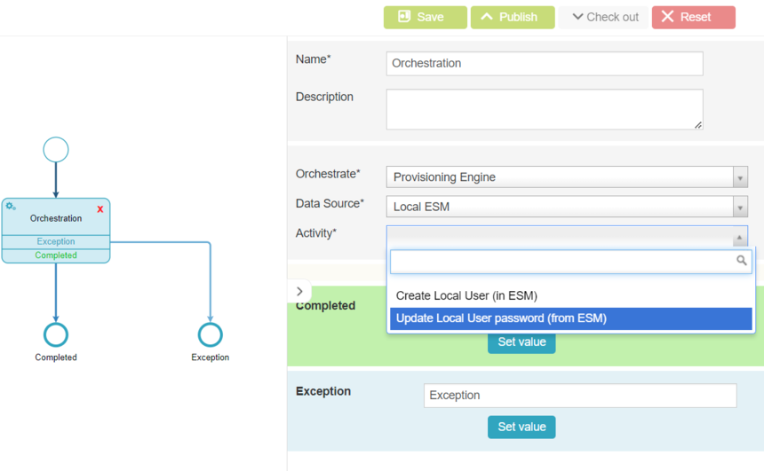

# EPE: Capability to create local users to ESM via workflow

**Källa:** https://community.efecte.com/t/83h0288/epe-capability-to-create-local-users-to-esm-via-workflow
**Publicerad:** 2023-01-17T06:57:00.000Z
**Uppdaterad:** 2023-02-06T08:40:15.353000
**Författare:** 

---

EPE: Capability to create local users to ESM via workflow

      
    
          
      

        
              Tuija Länsisalmi
            

            
              Tuija_Lansisalmi
            updated 2 yrs agoMon, February 6, 2023 at 8:40 AM GMT+1
  

          1reply
        Teemu LyytinenEfecte Employee2 yrs agoMon, February 6, 2023 at 10:28 AM GMT+1
  
         Done
        

        
    
User story: 
 As an administrator, I would like to create ESM Local Users easily with workflow.   
 Capability to change local user password and create local users to ESM via workflow orchestration node.    
 AC's:  
 
 EPE support Local User creation 
 EPE support Local User password update    
 
 Workflow Node:  
   
          
    
        EPE
      
    
        Workflow
      
    
  
  Vote
  Follow
    
            4

## Bilder

