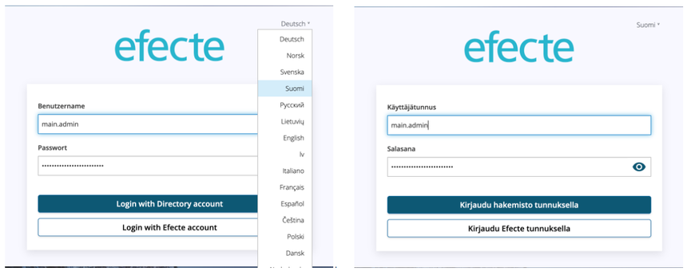

# ESA: More language options

**Källa:** https://community.efecte.com/t/35hahgd/esa-more-language-options
**Publicerad:** 2023-02-06T13:07:27.830Z
**Uppdaterad:** 2023-02-06T14:07:27.830000
**Författare:** 

---

ESA: More language options

      
    
          
      

        
              Tuija Länsisalmi
            

            
              Tuija_Lansisalmi
            2 yrs agoMon, February 6, 2023 at 2:07 PM GMT+1
  

           Done
        

        
    
User story: 
 As an end-user, I want to see the login screen in my language. As an ESA admin, I want easily define default language options to ESA and get a comprehensive selection of languages.  
  
 AC's:  
 
 Increase ESA language options 
 Easy manage of languages 
 Default languages are: English, Finnish, Svenska and Deutsch. 
 Available languages are: English US, English UK, Finnish, German, Swedish, Polish, Croatian, Czech, Danish, Dutch, Estonian, French, Italian, Latvian, Lithuanian, Norwegian, Russian, Spanish and Turkish. 
 
  
 ESA Login Screen:  
   
          
  Vote
  Follow

## Bilder

