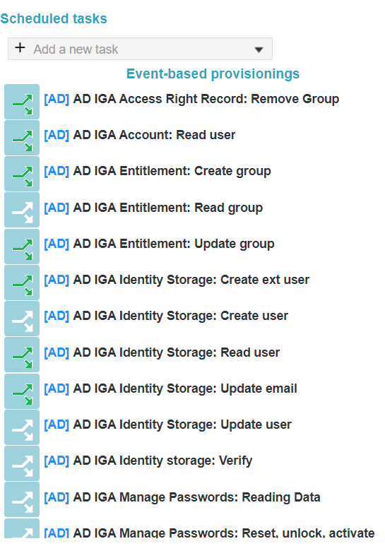

# EPE: Event-based provisionings displayed green if in use

**Källa:** https://community.efecte.com/t/m1harya/epe-event-based-provisionings-displayed-green-if-in-use
**Publicerad:** 2023-03-02T06:18:08.670Z
**Uppdaterad:** 2023-03-02T07:18:08.670000
**Författare:** 

---

EPE: Event-based provisionings displayed green if in use

      
    
          
      

        
              Tuija Länsisalmi
            

            
              Tuija_Lansisalmi
            2 yrs agoThu, March 2, 2023 at 7:18 AM GMT+1
  

           Roadmapped
        

        
    

      
          

    
        
        
        
      

    

  ContentsUser story:Background information:What?How?Why?To whom?  
User story: 
 As an admin of Efecte's Provisioning Engine tool (EPE), I want to easily see which event-based provisionings are in use and which are not.  
Background information: 
What? 
 
 This is part of the EPE usage improvements story 
 
How? 
 
 EPE UI is updated to show event-based statuses based on the colors 
   
   Green = Task is attached to published workflow 
   Yellow = Task is attached to unpublished workflow 
   White/Default = Task is not attached to any workflow 
    
 
Why? 
 
 This helps in maintaining EPE tasks 
 The dependency of EPE event-based tasks and workflows becomes visible 
 
To whom? 
 
 Efecte provisioning engine admins 

          
    
        EPE
      
    
  
  Vote
  Follow
    
            1

## Bilder

