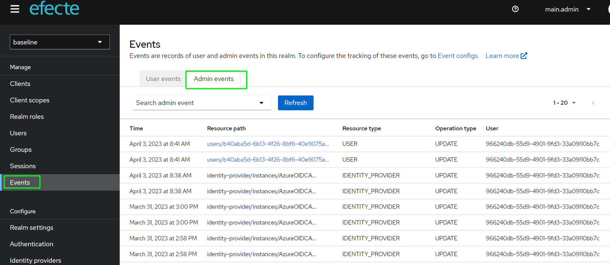

# ESA: Support for auditing Admin events

**Källa:** https://community.efecte.com/t/p8hck9z/esa-support-for-auditing-admin-events
**Publicerad:** 2023-04-14T06:12:14.050Z
**Uppdaterad:** 2023-04-14T08:12:14.050000
**Författare:** 

---

ESA: Support for auditing Admin events

      
    
          
      

        
              Tuija Länsisalmi
            

            
              Tuija_Lansisalmi
            2 yrs agoFri, April 14, 2023 at 8:12 AM GMT+2
  

          

        
    

      
          

    
        
        
        
      

    

  ContentsUser story:Background information:What?How?Why?To whom?User story: 
 As an Admin of Efecte's Secure Access tool (ESA), I want that any action an ESA admin performs within the admin console can be recorded for auditing purposes. The resulting events can then be viewed in the ESA Admin Console.  
  
Background information: 
What? 
 
  Any action an admin performs within the ESA admin console can be recorded for auditing purposes. 
 
How? 
 
   ESA allows save admin events to admin console.   
 
Why? 
 
 Auditing admin events can help ensure the security of the ESA by tracking Admin activities. Activities such as  changes to the logins or adding new ones.  
 
To whom? 
 
 All ESA customers 
   
   ESA Administrator can decide to use or not to use 
    

          
    
        ESA
      
    
  
  Vote
  Follow

## Bilder

