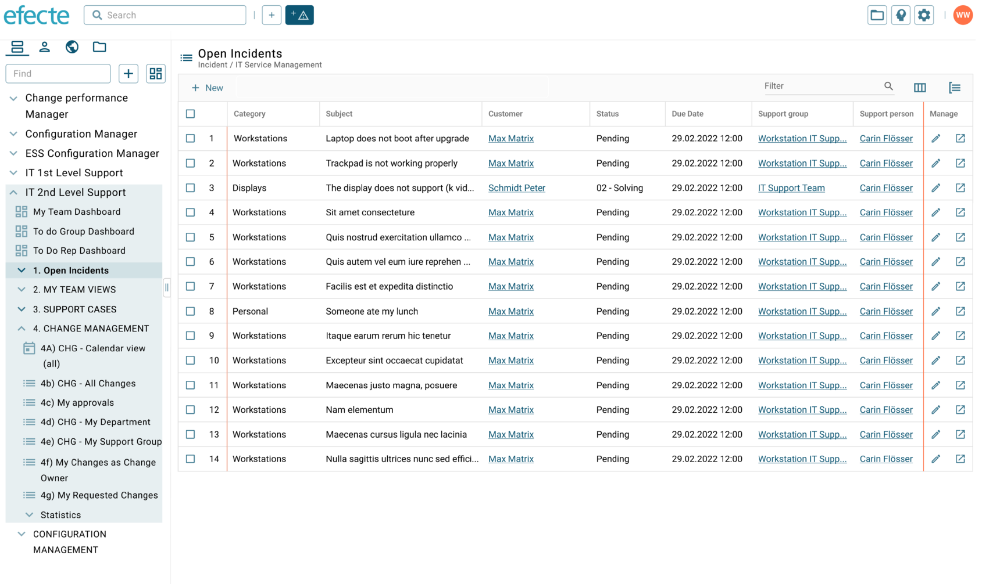

# ESM: New beta UI with new list view and datacard view

**Källa:** https://community.efecte.com/t/p8hamxh/esm-new-beta-ui-with-new-list-view-and-datacard-view
**Publicerad:** 2023-02-14T14:20:59.633Z
**Uppdaterad:** 2023-04-21T14:11:11.377000
**Författare:** 

---

ESM: New beta UI with new list view and datacard view

      
    
          
      

        
              Jonne KaukoProduct Manager
            

            Senior Product Manager & Product Lead, M42 Core & Pro
              Jonne_Kauko
            updated 2 yrs agoFri, April 21, 2023 at 2:11 PM GMT+2
  

          3replies
        Jonne KaukoProduct Manager2 yrs agoFri, April 21, 2023 at 2:10 PM GMT+2
  
        

        
    

      
          

    
        
        
        
      

    

  ContentsUser story:Background information:What?How?Why?To whom?User story: 
 As a user of Efecte's Service Management Tool (ESM), I want to enjoy a modern user interface for viewing and editing data through a modern list view and datacard view.   
Background information: 
What? 
 
 The ESM Agent UI renewal will be continued with new beta versions of the list view and datacard view.  More information about the new datacard view can be found in this post. 
 
How? 
 
 The renewed UI is delivered through a new UI application 
 Users can keep using the current UI if they like until further notice 
 The new UI can be accessed via the current UI and a separate URL 
 The initial release will include features and capabilities for facilitating normal agent users’ most common use cases. More capabilities will be delivered in future releases.  
 The new UI will be developed iteratively based on user feedback 
 
Why? 
 
 The list view and datacard view are integral parts of the UI. 
 These two view types are the ones that are used for running every process and activity across the tool. 
 Renewing these UI parts will have the most significant UX impact on the users. 
 
To whom? 
 
 Normal agents working with basic use cases on the top of the list view and datacard view. 
 The new UI will be available for cloud (shared, dedicated) and private cloud deployments. 
 The new UI is not available for windows-based on-prem deployments 

          
    
        Service Management Tool
      
    
  
  Vote
  Follow
    
            2

## Bilder

