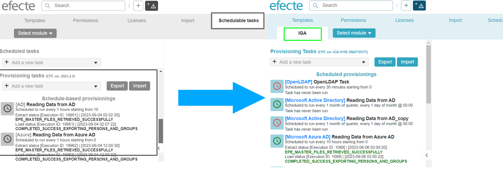

# Efecte Provisioning Engine new place

**Källa:** https://community.efecte.com/t/g9yqpdt/efecte-provisioning-engine-new-place
**Publicerad:** 2023-09-06T06:26:05.013Z
**Uppdaterad:** 2023-09-06T08:26:05.013000
**Författare:** 

---

Efecte Provisioning Engine new place

      
    
          
      

        
              Tuija Länsisalmi
            

            
              Tuija_Lansisalmi
            2 yrs agoWed, September 6, 2023 at 8:26 AM GMT+2
  

          

        
    

      
          

    
        
        
        
      

    

  ContentsUser story:Background information:What?How?Why?To whom?User story: 
 As an admin of Efecte Provisioning Engine tool (EPE), I want to easily see provisioning task and those statuses.  
Background information: 
What? 
 Efecte provisioning engine is moved from Schedulable tasks to own tab called IGA.  
How? 
 Existing tasks will be moved here automatically. This does not require any maintenance.  
Why? 
 
 This change clarifies the difference between ESM schedulable tasks and EPE provisioning tasks 
 Usability improvement, the EPE administrator user no longer needs to drag the mouse down to access the provisioning tasks 
 
To whom? 
 EPE Administrators 
          
    
        EPE
      
    
  
  Vote
  Follow

## Bilder

