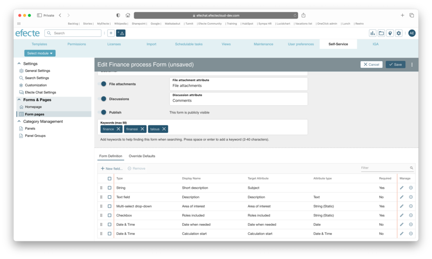

# Efecte Self-Service (ESS2): Easy administration of Forms

**Källa:** https://community.efecte.com/t/p8hvb6y/efecte-self-service-ess2-easy-administration-of-forms
**Publicerad:** 2023-08-15T12:39:00.000Z
**Uppdaterad:** 2023-09-07T08:12:21.400000
**Författare:** 

---

Efecte Self-Service (ESS2): Easy administration of Forms

      
    
          
      

        
              Aki YlivarviModerator
            

            
              Aki_Ylivarvi
            updated 2 yrs agoThu, September 7, 2023 at 8:12 AM GMT+2
  

           Released
        

        
    
 Problem statement  
 Administrating ESS2 forms from the template side must be improved for future needs. Also, it would be beneficial if all the administrators could make all configuration changes in a centralized location.   
  Short description  
 Removing the Form editor from the Template configuration area and introducing the new Form editor to the Self-Service administration area is the first step to even easier administration of the ESS2.  
  Use case details  
 As an ESS2 admin, I want to be able to Create, Update, View, and Delete a Form and its Fields on the new configuration area. I shall also be able to set the field to be required if needed. Following characteristics shall apply to a new way of managing forms:  
 
   The admins shall be able to add new or remove new forms from the Forms configuration area   
   The admins shall be able to add, configure or remove fields from the Forms configuration area when the Form is on editing mode   
   The admins shall be able to set field to be required while configuring the field   
 
 New form fields editor:  
   
          
    
        Self-Service Portal
      
    
        ESS2
      
    
  
  Vote
  Follow

## Bilder

