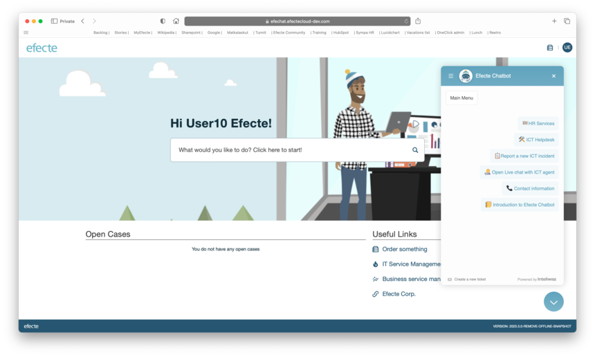

# Efecte Self-Service (ESS2): Efecte Chat top of ESS2

**Källa:** https://community.efecte.com/t/q6yqpaz/efecte-self-service-ess2-efecte-chat-top-of-ess2
**Publicerad:** 2023-09-06T14:13:14.183Z
**Uppdaterad:** 2023-09-07T08:12:37.680000
**Författare:** 

---

Efecte Self-Service (ESS2): Efecte Chat top of ESS2

      
    
          
      

        
              Aki YlivarviModerator
            

            
              Aki_Ylivarvi
            updated 2 yrs agoThu, September 7, 2023 at 8:12 AM GMT+2
  

           Released
        

        
    
 Problem statement  
 Customers would like to use both - Efecte's Chat and Efecte Self-Service 2 (ESS2) - in single environment.  
  Short description  
 Efecte Chat functionalities, as they were introduced on top of the ESS, can be also used on top of the ESS2.   
  Use case details  
 As an ESS2 admin, I want to be able to enable Efecte Chat for our end users with following use cases:   
 
   End user can access chat in ESS2   
   Support agent can access chat in ESM   
   Support agent can identify the end user   
   End user can identify the agent   
   Opening a new ticket from chat link   
   Automatic ticket creation from chatbot   
 
   
          
    
        Self-Service Portal
      
    
        ESS2
      
    
  
  Vote
  Follow

## Bilder

