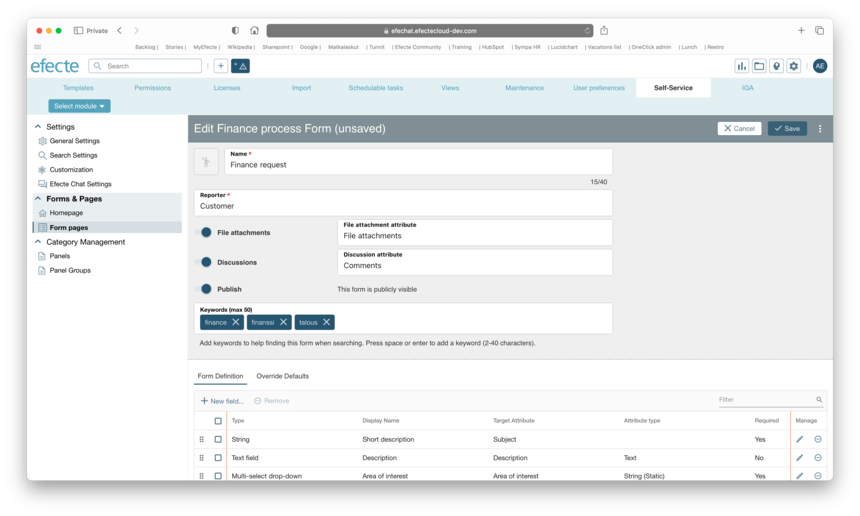
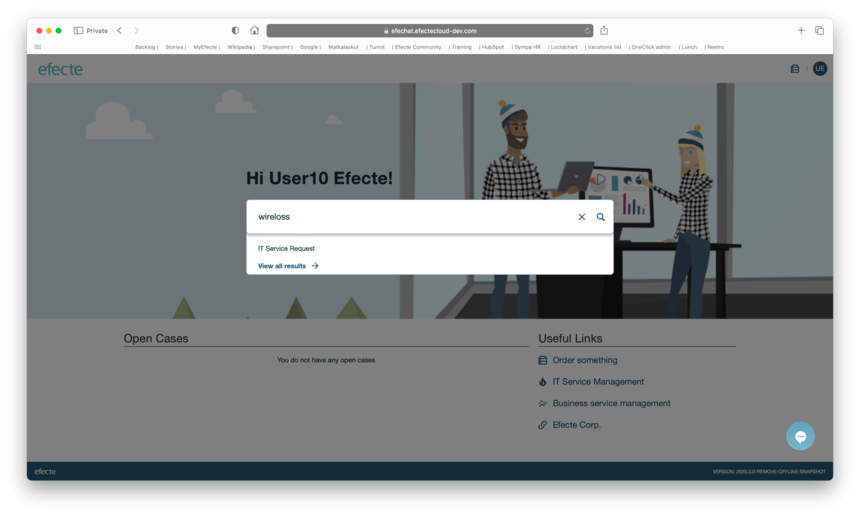
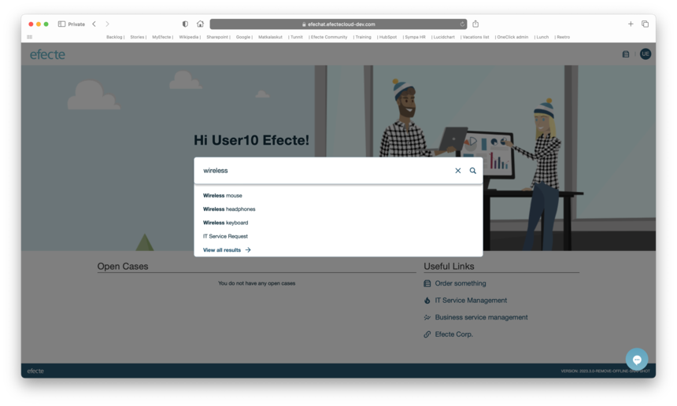
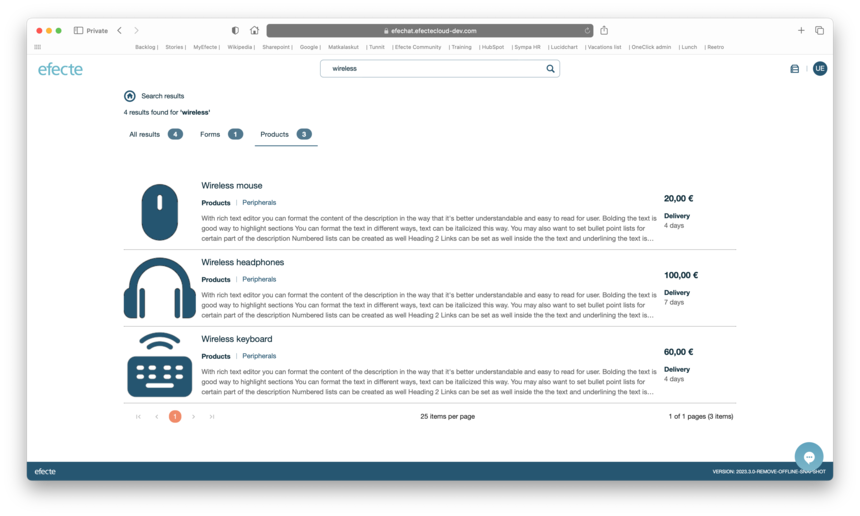

# Efecte Self-Service (ESS2): Improved Search Functionalities

**Källa:** https://community.efecte.com/t/m1yqpv9/efecte-self-service-ess2-improved-search-functionalities
**Publicerad:** 2023-09-06T15:01:53.253Z
**Uppdaterad:** 2023-09-07T08:12:53.460000
**Författare:** 

---

Efecte Self-Service (ESS2): Improved Search Functionalities

      
    
          
      

        
              Aki YlivarviModerator
            

            
              Aki_Ylivarvi
            updated 2 yrs agoThu, September 7, 2023 at 8:12 AM GMT+2
  

           Released
        

        
    
 Problem statement  
 Since Efecte's Self-Service 2 (ESS2) supports multiple Forms for initiating support processes, it needs to start including Forms to search results through the homepage and sub-page search.   
  Short description  
 To give the end users better search results from the defined Forms and Product catalog items, the ESS2 search results mechanism needs to be updated. With more precise and classified results pages, including keyword search, the end users will get more help when using ESS2.   
  Use case details  
 As an ESS2 admin, I want to be able to offer better search results to ESS2 end users:   
 
   The forms shall be included in the search results.   
   The search results page shall be renewed, including filtering results to 'all results', 'only forms', and 'only product items' with pagination if there are lots of topics to be shown.   
   The admin shall be able to define keywords for Forms and to the Product catalog items  
   
     Search should be able to search also from the keywords, but prioritizing the subject first   
     Keyword search shall give little understanding for minor typos   
    
 
 Defining keywords in Forms editor:  
    
 Fuzzy search giving results from keywords even there is minor typo:  
    
 Search results including Forms and Product items:  
    
 Renewed search results page including filters:  
   
          
    
        Self-Service Portal
      
    
        ESS2
      
    
  
  Vote
  Follow
    
            3

## Bilder

