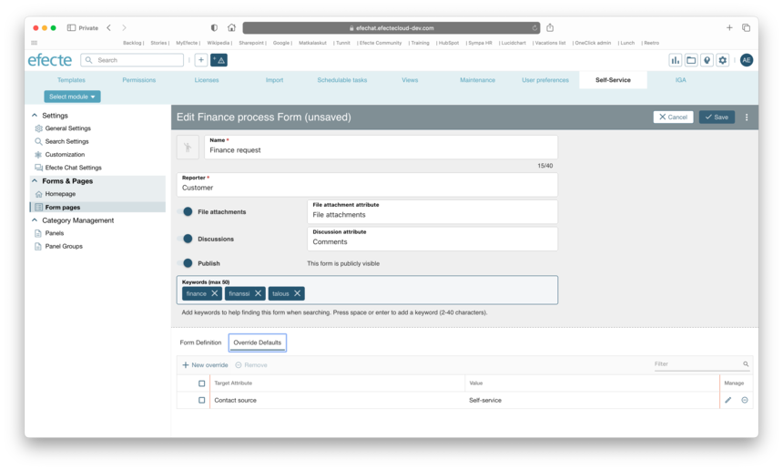

# Efecte Self-Service (ESS2): Override template default values

**Källa:** https://community.efecte.com/t/q6hvbtr/efecte-self-service-ess2-override-template-default-values
**Publicerad:** 2023-08-15T13:35:48.683Z
**Uppdaterad:** 2023-09-07T08:09:16.120000
**Författare:** 

---

Efecte Self-Service (ESS2): Override template default values

      
    
          
      

        
              Aki YlivarviModerator
            

            
              Aki_Ylivarvi
            updated 2 yrs agoThu, September 7, 2023 at 8:09 AM GMT+2
  

           Released
        

        
    
 Problem statement  
 Currently, agents must fill or fix the information on data cards created through the ESS2. Agents expect that ESS2 forms prefill specific data for statistical analysis by default.  
  Short description  
 The self-service configuration area for ESS2 will introduce a new configuration option for the forms. For each Form, the admin can configure one or many override values.   
  Use case details  
 As an ESS2 admin, I want to define override values which will be set to datacard when it is created through the ESS2.  
 
   The administrator shall be able to set "Override values" to each Form by navigating to its configuration tab on self-service admin page   
   Supported data types are: String, Text and Static string   
   When the values are set in the configurator, all datacards that are created shall use given override values of used form   
 
 Override defaults configuration located next Form definition tab:  
   
          
    
        Self-Service Portal
      
    
        ESS2
      
    
  
  Vote
  Follow

## Bilder

