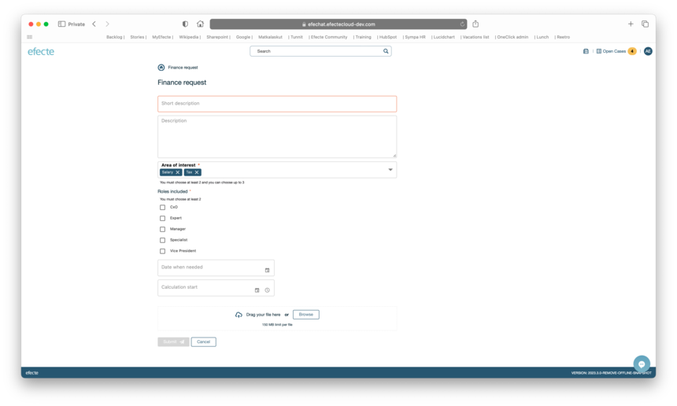

# Efecte Self-Service (ESS2): Support for new field types

**Källa:** https://community.efecte.com/t/35hvbmx/efecte-self-service-ess2-support-for-new-field-types
**Publicerad:** 2023-08-15T13:16:26.553Z
**Uppdaterad:** 2023-09-07T08:11:07.980000
**Författare:** 

---

Efecte Self-Service (ESS2): Support for new field types

      
    
          
      

        
              Aki YlivarviModerator
            

            
              Aki_Ylivarvi
            updated 2 yrs agoThu, September 7, 2023 at 8:11 AM GMT+2
  

           Released
        

        
    
 Problem statement  
 ESS2 has supported field types such as string, single-value static string, and text from its launch. However, so that admins can configure much more extensive forms for collecting data, new field types such as dates and multi-value static strings are needed.  
  Short description  
 ESS2 will introduce four new types of fields for admins to configure in the ESS2 Forms: date, date and time, multi-value static string and checkbox.  
  Use case details  
 
 As an administrator, I want to allow my users to specify a date and/or time as a response to a question, so that my agents can use the information appropriately. 
 As an administrator, I want my users to be able to select one or more items from a specified set which is based on template static selection values. 
 As an administrator, I want to provide a checkbox selection for the end-user, so they can select one or more items from specified values. Checkbox values are based on template static selection values. 
 
  
 New field types:  
   
          
    
        Self-Service Portal
      
    
        ESS2
      
    
  
  Vote
  Follow

## Bilder

