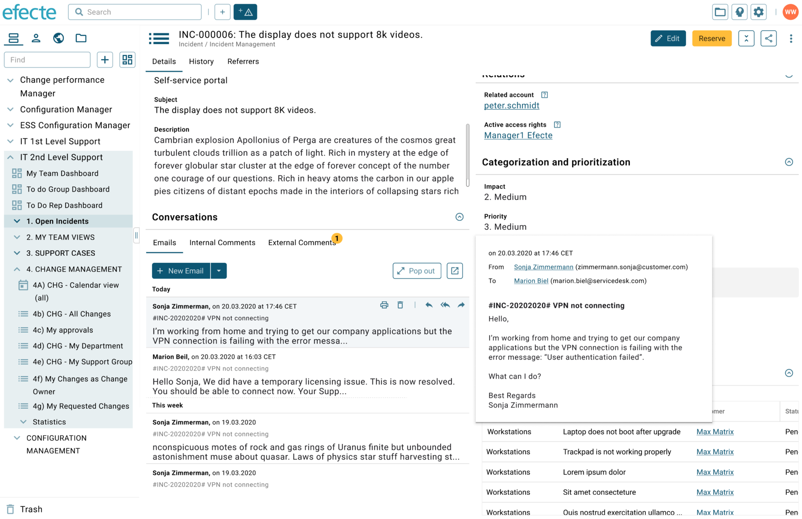
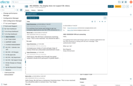
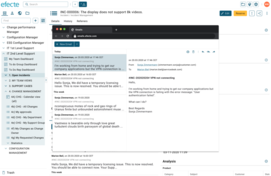

# Efecte Service Management tool (ESM): Viewing and sending emails from the new beta UI datacard view

**Källa:** https://community.efecte.com/t/y4hxr92/efecte-service-management-tool-esm-viewing-and-sending-emails-from-the-new-beta-ui-datacard-view
**Publicerad:** 2020-07-07T05:06:00.000Z
**Uppdaterad:** 2023-08-21T07:48:08.590000
**Författare:** 

---

Efecte Service Management tool (ESM): Viewing and sending emails from the new beta UI datacard view

      
    
          
      

        
              Aki Koivukoski
            

            R&D
              Aki_Koivukoski
            updated 2 yrs agoMon, August 21, 2023 at 7:48 AM GMT+2
  

          10replies
        Jonne KaukoProduct Manager2 yrs agoTue, February 14, 2023 at 3:34 PM GMT+1
  
         Done
        

        
    

      
          

    
        
        
        
      

     
          
          
          

  

  ContentsUser story:AC's:User story: 
 As a user of Efecte's Service Management Tool (ESM) I want to enjoy a modern user interface for reading and creating emails in order to work not only effectively but also with delight.  
AC's: 
 
   Visual presentation of the email previews in the datacard view  
   
     If there is at least an attribute with EntityStateMail handler and an attribute with Worklog handler in the same class, the EntityStateMail handler should be presented as a tab. Worklog handlers should be also presented on tabs.   
     
       The tab label should be equal to the attribute name. The name should be translatable.     
       If the class has more than one attribute with entityStateMail, they should be shown as tabs  
       
         In case the class has just one entityStateMail handler and no worklog handlers, then the entityStateMail should be shown without the tabs (without the bar with the tabs)   
        
       The order of the tabs should be defined by the order of the attributes inside of the class   
      
     Users should be able to view emails in chronological order in the detail view  
     
       The most recent email is shown first on the list   
       Emails should be grouped by "Today", "This week", "Older" :question_mark:   
       
         These headers should be shown even though there would be no emails. There should be a placeholder showing that there are no emails under the heading.    
        
      
     The user should be able to see the "from" information of each email.   
     
       If no person is found, the senders name and emails address should be shown without a link   
       In case there is a person card for the sender, it should be shown as a reference (link).   
       
         The mail.addressbook.codes setting should be used for determining the template and attribute to be used for creating the link to the person   
        
      
     The user should be able to see the timestamp (send/receive time) of the email    
     The user should be able to see a preview (one row, with line breaks removed) of each email    
     Users should be able to scroll the emails within the email box both with mobile devices and desktop  
     
       Scroll bar should be visible and usable   
      
     Users should be able to see a preview in a tooltip when hovering on the emails. The tooltip should contain the following information:  
     
       Timestamp (Send/receive date and time) in the local, user-based timezone, format based on datetime.output.pattern   
       FROM information (name + address)    
       TO information (name + address)    
       Subject   
       Body including visual formatting and inline images   
       List of attachments   
      
    
   Visual presentation of the detailed email view (floating window), reading emails and sending emails  
   
     Users should be able to see all emails in a dedicated overlay by clicking on one of the emails or by selecting "New email"   
     
       The UI text for the "New email" button should be translatable as currently (presentation text)   
       The user should be able to move around the overlay   
      
     There should be an option to open the overlay in a separate browser window  
     
       When opening the email overlay in a separate browser window, the overlay should not anymore be shown   
      
     The visual presentation of the email previews should be similar in all cases (datacard view, overlay, separate browser window)   
     There should be an option to download the .msg file   
     The user should be able to remove emails   
     The user should be able to see the TO, CC, BCC and from information in the email preview section   
    
   Creating and sending emails  
   
     The user should be able to create a new email based on the EntityStateMail defaultConfiguration by selecting clicking "New email" or by selecting an email template, in case they have update or create permissions for the email attribute  
     
       If several email templates have been defined then the user can select the email template   
       The default email template should be applied to the case when the user does create a new emails, forward an email or reply/reply all to an email.   
       
         The user should have a possibility to select the email template when replying to an email   
        
       The email template should be selectable also from an attribute, if the Mail templates attribute has been configured   
       The attachments should be uploaded to the attribute defined in Uploaded attachments attribute setting   
      
     The email body should be written by using a rich text editor   
     Users should be able to edit the TO & CC & BCC email address when replying to an email, for example, double-clicking the already given address object   
     
       The user should be able to select the recipient from the addressbook. The mail.addressbook.codes setting should be applied.     
      
     The user should be able to edit the from field in case the From field editable setting is enabled   
     Users should be able to reply, reply all, and forward the email by the click of a button   
     Users should be able to mark an email as read or unread by clicking a button. The read/unread parameter is global as currently.   
     The number of unread emails should be shown as a label   
     Only rich text (html) format should be supported - no plain text emails should be supported   
     Attachments are shown with their file name as links   
    

          
    
        Service Management Tool
      
    
  
  Vote
  Follow
    
            15

## Bilder

