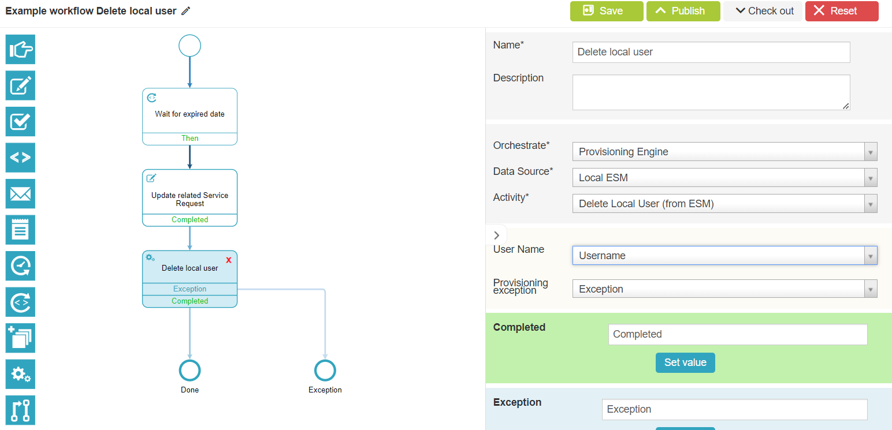

# EPE: Capability to delete local users to ESM via workflow

**Källa:** https://community.efecte.com/t/q6hvaxm/epe-capabilityto-delete-local-users-to-esm-via-workflow
**Publicerad:** 2023-08-21T05:46:17.517Z
**Uppdaterad:** 2023-08-21T07:46:17.517000
**Författare:** 

---

EPE: Capability to delete local users to ESM via workflow

      
    
          
      

        
              Tuija Länsisalmi
            

            
              Tuija_Lansisalmi
            2 yrs agoMon, August 21, 2023 at 7:46 AM GMT+2
  

          

        
    

      
          

    
        
        
        
      

    

  ContentsUser story:Background information:What?How?Why?To whom?User story: 
 As an admin of Efecte Provisioning Engine tool (EPE), I want to delete ESM Local Users easily with workflow.   
  
Background information: 
What? 
 
   EPE must have functionality for deleting users for ESM (not directory, local)   
 
How? 
 
 The EPE Administrators  can configure Orchestration node for Local Efecte User provisioning for deleting existing user 
 
Why? 
 
 This feature allows Efecte Admin to manage the lifecycle of local users 
 Security improvement. No one has to remember to delete local users, it happens automatically according to the workflow conditions 
 
To whom? 
 
 EPE Administrators 

          
    
        EPE
      
    
        Workflow
      
    
  
  Vote
  Follow

## Bilder

