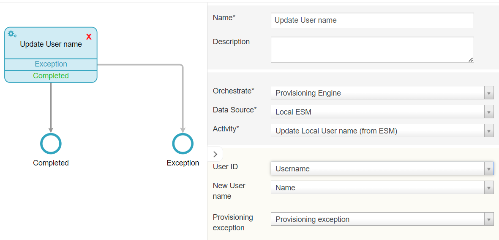

# EPE: Capability to update local user's username

**Källa:** https://community.efecte.com/t/p8yqpdj/epe-capability-to-update-local-users-username
**Publicerad:** 2023-09-06T06:34:20.027Z
**Uppdaterad:** 2023-09-06T08:34:20.027000
**Författare:** 

---

EPE: Capability to update local user's username

      
    
          
      

        
              Tuija Länsisalmi
            

            
              Tuija_Lansisalmi
            2 yrs agoWed, September 6, 2023 at 8:34 AM GMT+2
  

          

        
    

      
          

    
        
        
        
      

    

  ContentsUser story:Background information:What?How?Why?To whom?User story: 
 As an admin of Efecte Provisioning Engine tool (EPE), I want to update ESM Local User's username easily with workflow.   
  
Background information: 
What? 
 EPE must have functionality for updating ESM Local User's username   
How? 
 The EPE Administrators  can configure Orchestration node for Local Efecte User provisioning for updating existing username  
Why? 
 This feature allows Efecte Admin to manage the lifecycle of local users  
To whom? 
 EPE Administrators 
          
    
        EPE
      
    
  
  Vote
  Follow

## Bilder

