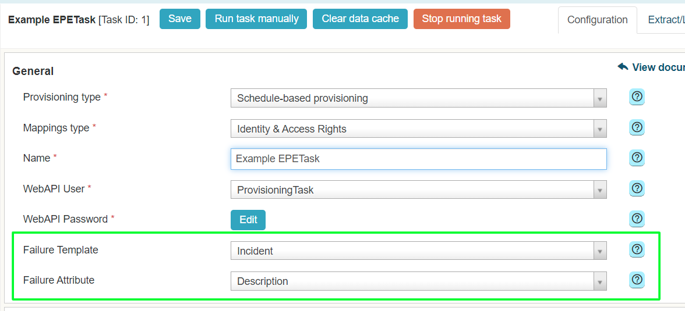

# EPE: Error handling improvement: a ticket to ESM

**Källa:** https://community.efecte.com/t/q6hvq45/epe-error-handling-improvement-a-ticket-to-esm
**Publicerad:** 2023-07-31T09:27:00.323Z
**Uppdaterad:** 2023-09-01T09:30:09.810000
**Författare:** 

---

EPE: Error handling improvement: a ticket to ESM

      
    
          
      

        
              Tuija Länsisalmi
            

            
              Tuija_Lansisalmi
            updated 2 yrs agoFri, September 1, 2023 at 9:30 AM GMT+2
  

           In Progress
        

        
    

      
          

    
        
        
        
      

    

  ContentsUser story:Background information:What?How?Why?To whom?User story: 
 As an admin of Efecte Provisioning Engine tool (EPE), I want automatic tickets when there is EPE error. No need to check separately if there are errors.   
Background information: 
What? 
 
   EPE error handling improvement: a ticket (incident, admin_task or is selectable) to ESM is created if scheduled-based EPEtask fails   
 
How? 
 
 The EPE Administrators  can choose which data card Efecte creates if an error occurs while processing a scheduled task.  
 
Why? 
 
 The administrator must be able to quickly detect error situations 
 The administrator will immediately see what the error is. And can act on the instructions to correct it or even automate the process 
 
To whom? 
 
 EPE Administrators 

          
    
        EPE
      
    
  
  Vote
  Follow
    
            1

## Bilder

