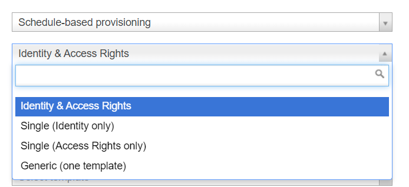

# EPE: Scheduled task option to read only groups or users

**Källa:** https://community.efecte.com/t/g9hvaxc/epe-scheduled-task-option-to-read-only-groups-or-users
**Publicerad:** 2023-08-21T06:26:44.813Z
**Uppdaterad:** 2023-08-21T08:28:22.560000
**Författare:** 

---

EPE: Scheduled task option to read only groups or users

      
    
          
      

        
              Tuija Länsisalmi
            

            
              Tuija_Lansisalmi
            updated 2 yrs agoMon, August 21, 2023 at 8:28 AM GMT+2
  

          

        
    

      
          

    
        
        
        
      

    

  ContentsUser story:Background information:What?How?Why?To whom?User story: 
 As an admin of Efecte's Provisioning Engine tool (EPE), I want to easily configure new EPE tasks just right for our use case.  
 As an admin I want to EPE support importing groups or users not always both of them. At the moment, it is not possible to choose to import only users or groups.    
Background information: 
What? 
 
 This is part of the EPE usage improvements story 
 
How? 
 
   EPE Administrator can choose Mappings type for scheduled-based task from these options:  
   
     Identity & Access rights - users and groups mappings are available   
     Single (Identity only) - only Users mappings are available   
     Single (Access Rights only) - only Groups' mappings are available   
     Generic (One template) - template mappings are available   
     Default is Identity & Access rights   
    
 
Why? 
 
 This helps configuring EPE tasks, more flexibility 
 
To whom? 
 
 EPE Administrators 

          
    
        EPE
      
    
  
  Vote
  Follow

## Bilder

