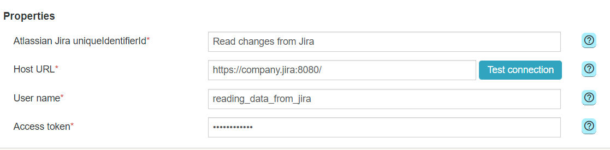

# EPE: Support for Jira connector

**Källa:** https://community.efecte.com/t/p8hvaxr/epe-support-for-jira-connector
**Publicerad:** 2023-08-21T06:15:10.833Z
**Uppdaterad:** 2023-09-07T06:52:31.290000
**Författare:** 

---

EPE: Support for Jira connector

      
    
          
      

        
              Tuija Länsisalmi
            

            
              Tuija_Lansisalmi
            updated 2 yrs agoThu, September 7, 2023 at 6:52 AM GMT+2
  

          

        
    

      
          

    
        
        
        
      

    

  ContentsUser story:  Background information:What?How?Why?To whom?User story:   
 
 As an Admin of Efecte's Provisioning Engine tool (EPE), I want to use connector from Efecte ESM to Atlassian Jira.  
 As an Jira Admin I want to create and delete Jira users 
 As an Jira Admin I want to create and delete Jira groups  
 As an Jira Admin I want to add user to Group 
 As an Jira Admin I want to remove user from Group 
 
Background information: 
What? 
 
 New Atlassian Jira connector to EPE (only for IGA solutions) 
 
How? 
 
 Administrators are able configure connection to Efecte ESM using the EPE admin UI. 
   
   Processes can be run event-based triggered by Visual Workflow Automation 
    
 
Why? 
 
 EPE connector catalog must be comprehensive for customers 
 Efecte Jira connector support has been requested by multiple customers 
 
To whom? 
 
 EPE Administrators with IGA 
 EPE Customers with IGA 

          
    
        EPE
      
    
  
  Vote
  Follow

## Bilder

