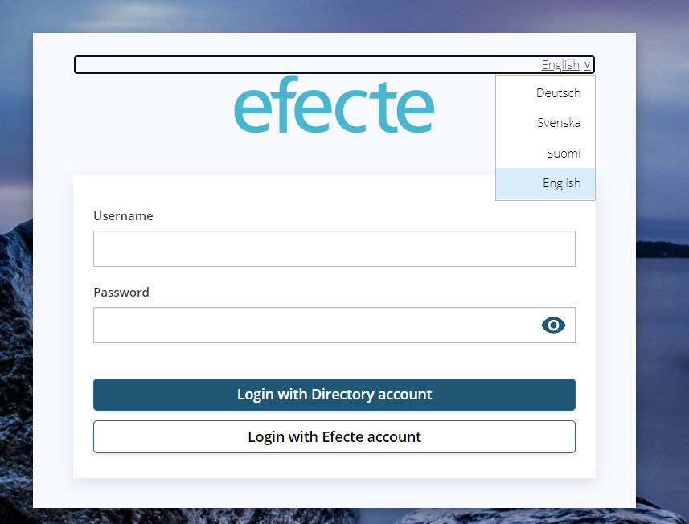

# ESA: The login language menu must be selectable from the keyboard

**Källa:** https://community.efecte.com/t/p8hva8x/esa-the-login-language-menu-must-be-selectable-from-the-keyboard
**Publicerad:** 2023-08-21T06:45:54.430Z
**Uppdaterad:** 2023-08-21T08:45:54.430000
**Författare:** 

---

ESA: The login language menu must be selectable from the keyboard

      
    
          
      

        
              Tuija Länsisalmi
            

            
              Tuija_Lansisalmi
            2 yrs agoMon, August 21, 2023 at 8:45 AM GMT+2
  

          

        
    

      
          

    
        
        
        
      

    

  ContentsUser story:Background information:What?How?Why?To whom?User story: 
 The end-user wants to easily log in to the ESA using just the keyboard without using the mouse  
Background information: 
What? 
 
 All functions of the ESA login page should be available on the screen reader and keyboard. 
 Part of The Web Content Accessibility Guidelines (WCAG) story 
 
How? 
 
 Users can use the ESA login page with keyboard 
 
Why? 
 
 ESA login page must support access to Efecte products, regardless of any conditions end-users might have  
 
To whom? 
 
 ESA Customers with multiple languages 

          
    
        ESA
      
    
  
  Vote
  Follow

## Bilder

