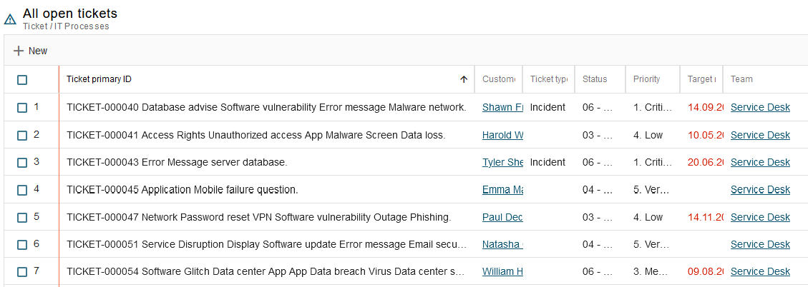

# ESM: Decreased minimum width of the list view columns

**Källa:** https://community.efecte.com/t/35yqljd/esm-decreased-minimum-width-of-the-list-view-columns
**Publicerad:** 2023-09-01T11:43:48.563Z
**Uppdaterad:** 2023-09-01T14:05:40.747000
**Författare:** 

---

ESM: Decreased minimum width of the list view columns

      
    
          
      

        
              Jonne KaukoProduct Manager
            

            Senior Product Manager & Product Lead, M42 Core & Pro
              Jonne_Kauko
            updated 2 yrs agoFri, September 1, 2023 at 2:05 PM GMT+2
  

           Done
        

        
    

      
          

    
        
        
        
      

    

   Problem statement  
 Thanks to the new list view in the early access beta UI of the Efecte Service Management tool, users can change the column width. However, the minimum width is not narrow enough - it consumes space unnecessarily. Therefore, users cannot see as many columns on the screen as they would like to.  
  Short description  
 The minimum width of the list view columns is to be decreased.   
  Use case details  
 The minimum width is to be defined so that a few characters of the attribute values are shown.  
          
  Vote
  Follow
    
            1

## Bilder

