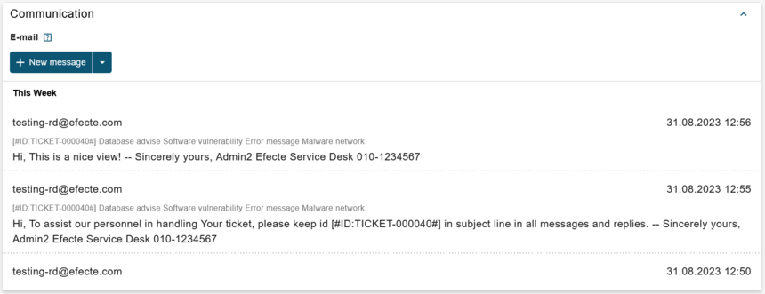
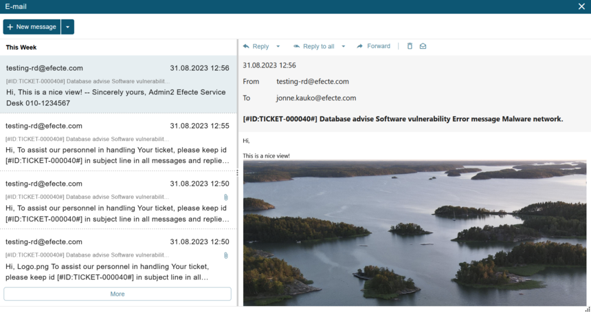

# ESM: Improvements to the new email UI in the new datacard view

**Källa:** https://community.efecte.com/t/h7yqln7/esm-improvements-to-the-new-email-ui-in-the-new-datacard-view
**Publicerad:** 2023-09-01T14:47:11.543Z
**Uppdaterad:** 2023-09-01T16:47:11.543000
**Författare:** 

---

ESM: Improvements to the new email UI in the new datacard view

      
    
          
      

        
              Jonne KaukoProduct Manager
            

            Senior Product Manager & Product Lead, M42 Core & Pro
              Jonne_Kauko
            2 yrs agoFri, September 1, 2023 at 4:47 PM GMT+2
  

           Done
        

        
    
 Problem statement   
 The early access beta UI in ESM 2023.2 includes an early development version of the email UI. Several capabilities, such as rich text and attachment handling, are unfortunately missing from the UI.   
  Short description  
 We plan to introduce several improvements to the email UI to prepare it for production use.  Capabilities such as rich text and attachment handling are to be included.  
  Use case details  
 The email editor capabilities are extended in various ways, while also improving the visual appearance and accessibility.   
 Some of the existing capabilities, such as opening the emails in a separate browser window, are to be implemented in future releases - we'll announce those separately later!  
 Email preview:   
   
 Email window:  
   
          
  Vote
  Follow
    
            1

## Bilder

